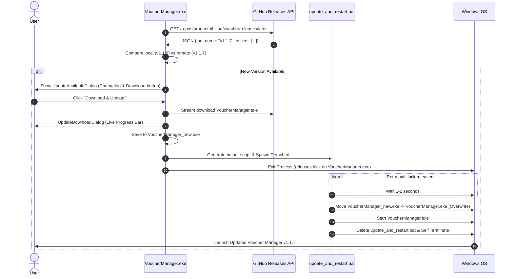

# System Architecture Documentation — Voucher Manager

## 1. Executive Summary & Architectural Goals

**Voucher Manager** is an enterprise-grade, standalone desktop application built in Python for SME payment voucher creation, multi-entity financial tracking, attachment aggregation, and precision voucher printing.

### Primary Architectural Principles:
1. **Zero-Data-Loss & Data Sovereignty**: All data lives locally in SQLite and the file system. Application binary updates through GitHub must never overwrite, modify, or erase user databases, attachments, or custom configurations.
2. **Zero-Dependency Portability**: Built to run on any 64-bit Windows workstation (Windows 10/11) without requiring Python, pip, or external runtime installations.
3. **High-Performance Hybrid Storage**: Separation of structured metadata (SQLite) from unstructured binary assets (disk file system) keeps database operations sub-millisecond even with thousands of vouchers.
4. **Multi-Entity Isolation**: Independent company profiles (Company 1 vs. Company 2) with distinct voucher sequences, custom headers, and branding logos.
5. **Modern Windows 11 Fluent UX**: High DPI-aware typography (Segoe UI), micro-animations, non-blocking asynchronous operations, and embedded true-scale PDF previewing.

---

## 2. Technology Stack & Component Matrix

| Layer | Component / Library | Architectural Role & Justification |
|---|---|---|
| **Core Runtime** | Python 3.13 (64-bit) | Modern language runtime with native typing and asynchronous capabilities. |
| **GUI Framework** | `Tkinter` + `ttkbootstrap` | Native Windows controls with CSS-like theming. Customized with Windows 11 Fluent light color system. |
| **Relational Database** | `sqlite3` (with WAL & Foreign Keys) | Embedded, zero-configuration SQL engine. ACID-compliant with sub-millisecond local reads. |
| **PDF Generation Engine** | `reportlab` (Platypus & Canvas) | Vector PDF rendering. Exact millimeter-accurate positioning for standard 2-vouchers-per-A4 sheets. |
| **PDF Viewing & Rasterization** | `pypdfium2` (Google PDFium wrapper) | Native C++ PDF rendering engine. High-resolution in-app rasterization with zero external dependencies. |
| **Image Processing** | `Pillow` (PIL) | Aspect-ratio preserving scaling, logo processing, and multi-format receipt encoding. |
| **Version Delivery Engine** | `urllib` + GitHub Releases REST API | Cloud delivery mechanism for automated version discovery, chunked streaming, and self-updating. |
| **Packaging & Distribution** | `PyInstaller` + UPX | Single-file portable `.exe` compiler with manifest embedding and DLL harvesting. |

---

## 3. High-Level Architecture Diagram

```mermaid
graph TD
    subgraph UI_Layer [Presentation & Interaction Layer (Tkinter / ttkbootstrap)]
        MW[MainWindow / Dashboard]
        CE[Voucher Creation Form]
        PV[Embedded PdfViewerDialog]
        UA[Update & Notification Dialogs]
        AM[Admin & Security Dialogs]
    end

    subgraph Business_Logic [Service & Engine Layer]
        PS[Print & PDF Engine (ReportLab)]
        VE[Version Delivery Engine (updater.py)]
        RS[PDFium Rasterization Engine (pypdfium2)]
        MS[Migration & Backup Pipeline]
    end

    subgraph Data_Storage [Hybrid Persistent Storage Layer]
        direction TB
        DB[(SQLite: vouchers.db)]
        FS[Disk Storage: data/attachments/]
        BK[Backup Snapshots: data/backups/]
    end

    subgraph Remote_Cloud [Remote GitHub Infrastructure]
        GH[GitHub Releases API / Binary Storage]
    end

    %% Interactions
    MW --> CE
    MW --> PV
    MW --> UA
    MW --> AM
    MW --> DB
    CE --> DB
    CE --> FS
    PV --> RS
    PS --> DB
    PS --> FS
    RS --> PS
    UA --> VE
    VE --> GH
    MS --> DB
    MS --> BK
```

---

## 4. Layered Architecture Deep-Dive

### 4.1. Presentation Layer (`ui/`)

The user interface follows a modern event-driven MVC/MVP pattern:
* **`main_window.py` (`MainWindow`)**:
  * **Dashboard**: 4 responsive stat cards (Total Vouchers, Bills Pending, Total Amount, Unprinted Count).
  * **Voucher Table**: Windows 11 styled Treeview with 28px row height, alternating row colors, attachment indicators (`📎 2`), and status badges.
  * **Multi-Field Search**: Real-time filtering across 8 fields with a 140ms debounce timer to ensure 60 FPS UI performance during rapid typing.
  * **Toast Notification System**: Sliding micro-animation banners for non-intrusive action feedback.
* **`widgets.py`**:
  * `AutocompleteEntry`: Keyboard-navigable dropdown with arrow key navigation, auto-fill, and usage frequency sorting.
  * `LineItemFrame`: Tabular ledger items with dynamic row insertion, keyboard shortcuts (`Enter` to add line), and automatic total calculation.
  * `MemoPanel`: Chronological follow-up and note tracking with categorized badges (General, Follow-up, Bill Status, Important).
  * `AttachmentPanel`: Drag-and-drop / file picker interface with instant thumbnail generation and disk path association.
* **`dialogs.py`**:
  * `PdfViewerDialog`: Native 100% zoom PDF viewer with canvas rendering, interactive zoom (`+`, `-`, `Ctrl+Wheel`), and direct Windows printing.
  * `UpdateAvailableDialog` & `UpdateDownloadDialog`: Version change presentation and streaming download progress.
  * `ClearVouchersDialog` & `DeleteDisabledVoucherDialog`: Password-protected administrative actions (`Praneeth1991`).

---

### 4.2. Hybrid Data Storage Architecture (`database.py`)

#### Why Hybrid Storage?
Storing large binary receipt images directly in SQLite database columns (`BLOB`) causes database bloat, slow queries, and cache thrashing. 

```
data/
├── vouchers.db               # Lightweight SQLite database (< 1 MB)
├── attachments/              # Physical receipt files indexed by SHA/UUID
│   ├── slip_20260918_01.jpg
│   └── invoice_20260918_02.pdf
└── backups/                  # Pre-migration automated database snapshots
    ├── vouchers_backup_20260918_235100_pre_migration.db
    └── ... (retains last 5 snapshots)
```

#### Relational Database Schema (`vouchers.db`):
```sql
-- 1. Multi-Company Entity Table
CREATE TABLE companies (
    id INTEGER PRIMARY KEY,
    name TEXT NOT NULL,
    tagline TEXT DEFAULT '',
    address TEXT DEFAULT '',
    contact TEXT DEFAULT '',
    email TEXT DEFAULT '',
    logo BLOB,                                    -- Stored as BLOB for persistence
    voucher_format TEXT DEFAULT 'date_based',      -- 'date_based' or 'sequential'
    custom_prefix TEXT DEFAULT 'V-',
    custom_start INTEGER DEFAULT 1,
    created_at TIMESTAMP DEFAULT CURRENT_TIMESTAMP
);

-- 2. Core Voucher Records
CREATE TABLE vouchers (
    id INTEGER PRIMARY KEY AUTOINCREMENT,
    company_id INTEGER NOT NULL DEFAULT 1,
    voucher_number TEXT NOT NULL,
    date TEXT NOT NULL,
    paid_to TEXT NOT NULL,
    cash_given_by TEXT NOT NULL,
    spent_by TEXT,
    total_amount REAL NOT NULL DEFAULT 0,
    bill_status TEXT DEFAULT 'Pending',            -- 'Pending', 'Received', 'Partial'
    status TEXT DEFAULT 'Active',                  -- 'Active', 'Cancelled'
    prepared_by TEXT,
    approved_by TEXT,
    created_at TIMESTAMP DEFAULT CURRENT_TIMESTAMP,
    updated_at TIMESTAMP DEFAULT CURRENT_TIMESTAMP,
    printed INTEGER DEFAULT 0,
    UNIQUE(company_id, voucher_number)             -- Guarantees isolated numbering per company
);

-- 3. Voucher Line Items (1-to-Many)
CREATE TABLE line_items (
    id INTEGER PRIMARY KEY AUTOINCREMENT,
    voucher_id INTEGER NOT NULL,
    description TEXT NOT NULL,
    category TEXT,
    amount REAL NOT NULL,
    FOREIGN KEY (voucher_id) REFERENCES vouchers(id) ON DELETE CASCADE
);

-- 4. File Attachment References (1-to-Many)
CREATE TABLE attachments (
    id INTEGER PRIMARY KEY AUTOINCREMENT,
    voucher_id INTEGER NOT NULL,
    filename TEXT NOT NULL,
    file_path TEXT,                                -- Path in data/attachments/
    file_size INTEGER,
    file_data BLOB,                                -- Nullable (legacy compatibility)
    file_type TEXT,
    created_at TIMESTAMP DEFAULT CURRENT_TIMESTAMP,
    FOREIGN KEY (voucher_id) REFERENCES vouchers(id) ON DELETE CASCADE
);

-- 5. Timestamped Memos (1-to-Many)
CREATE TABLE memos (
    id INTEGER PRIMARY KEY AUTOINCREMENT,
    voucher_id INTEGER NOT NULL,
    memo_text TEXT NOT NULL,
    memo_type TEXT DEFAULT 'General',
    created_by TEXT,
    created_at TIMESTAMP DEFAULT CURRENT_TIMESTAMP,
    FOREIGN KEY (voucher_id) REFERENCES vouchers(id) ON DELETE CASCADE
);

-- 6. Schema Migration Tracking Table
CREATE TABLE schema_migrations (
    version INTEGER PRIMARY KEY,
    name TEXT NOT NULL,
    applied_at TIMESTAMP DEFAULT CURRENT_TIMESTAMP
);
```

#### Database Performance Optimizations:
* **Composite Indexes**:
  * `idx_vouchers_comp_date ON vouchers (company_id, date DESC)`
  * `idx_vouchers_comp_status ON vouchers (company_id, status)`
  * `idx_attachments_vid ON attachments (voucher_id)`
  * `idx_line_items_vid ON line_items (voucher_id)`
  * `idx_memos_vid ON memos (voucher_id)`
* **Foreign Key Constraints**: `PRAGMA foreign_keys = ON` ensures referential integrity and cascading deletes.
* **Single-Subquery Attachment Counting**: Summary counts are calculated via subqueries to eliminate N+1 query patterns.

---

### 4.3. Print & Document Generation Engine (`printer.py`)

1. **A4 Sheet Geometry (2 Vouchers per Page)**:
   * Standard A4 is 595.27 pt wide by 841.89 pt tall.
   * Split into Top Slip (`y: 421 pt to 842 pt`) and Bottom Slip (`y: 0 pt to 421 pt`).
   * A horizontal dashed center-cut line (`canvas.setDash([4, 4])`) provides a precise cutting guide for scissors or paper trimmers.
2. **Company Header & Word-Wrapping Layout**:
   * Proportional logo placement (up to 38mm wide) preserving original aspect ratios.
   * Custom `_draw_wrapped_text` engine dynamically wraps long multi-line company addresses, phone numbers, and emails without overlapping boxes or title text.
   * 4mm inner clearance prevents border lines from crossing any text or logos.
3. **Smart Attachment Packing**:
   * Small slips / receipts (fuel stubs, taxi bills ≤ 1.35 MP) are automatically batched onto dedicated A4 pages (up to 4 receipts per page in a 2x2 grid) with dashed borders and voucher references to minimize paper waste.
   * Large documents and multi-page PDF attachments are rendered onto dedicated pages at 150+ DPI using `pypdfium2`.

---

### 4.4. Automated GitHub Version Delivery System (`updater.py`)

The application includes an automated self-updating mechanism that bypasses Windows executable file locking:



#### Windows In-Use Locking Solution:
Windows prevents modifying or overwriting an executable while it is executing (`ERROR_SHARING_VIOLATION`). To solve this cleanly:
1. `updater.py` generates a standalone batch script (`update_and_restart.bat`).
2. The batch script runs detached with `creationflags=subprocess.CREATE_NO_WINDOW | subprocess.DETACHED_PROCESS`.
3. The parent Python process immediately exits via `os._exit(0)`, releasing all file locks.
4. The batch script verifies the process has terminated, atomically replaces the binary, launches the new executable, and cleans up after itself.

---

### 4.5. Zero-Data-Loss Database Migration Engine

To satisfy the strict requirement: **"never replace or delete existing data, but manage table changes automatically"**:

1. **Physical Isolation**:
   * The binary update (`VoucherManager.exe`) operates strictly on the application executable.
   * The `data/` folder is external and completely separate from the executable archive.
2. **Pre-Migration Automated Online Snapshots**:
   * Before running any schema updates, `database.backup_database()` calls `sqlite3.Connection.backup()` to create a timestamped snapshot in `data/backups/`.
   * An automated rotation policy maintains the last 5 snapshots to protect disk space while ensuring rollback safety.
3. **Additive-Only Schema Evolution**:
   * The migration pipeline executes on every startup through `run_migrations()`.
   * It inspects existing tables using `PRAGMA table_info(table_name)`.
   * Missing columns are added dynamically via `ALTER TABLE {table} ADD COLUMN ...`.
   * **Destructive operations (`DROP TABLE`, `DROP COLUMN`) are strictly prohibited.**
   * Applied versions are recorded in `schema_migrations` to ensure idempotence.

---

### 4.6. Administrative Security & Purge Controls

To protect financial records from accidental or unauthorized destruction:
* **Password Guard**: All deletion routines require the master administrative password: **`Praneeth1991`**.
* **Soft-Cancel vs. Permanent Purge Separation**:
  * Standard users can only **Cancel (Disable)** a voucher (`Del` key). A cancelled voucher remains in the database with a struck-through badge and can be restored.
  * **Permanent Deletion** (`Shift+Del`) is restricted exclusively to vouchers that are *already disabled*. Active vouchers cannot be permanently deleted.
  * Attempting to permanently delete active vouchers prompts a warning requiring them to be disabled first.
* **Disk Purge Synchronization**:
  * When a voucher is permanently deleted or the database is wiped, the system queries the `attachments` table, unlinks and deletes the physical files from `data/attachments/`, and then removes the database records within an atomic transaction.

---

### 4.7. Build & Compilation Pipeline (`build_exe.py`)

The application compiles into a single, self-contained, portable Windows binary:

* **Packaging Command**:
  ```powershell
  python.exe -m PyInstaller \
      --noconsole \
      --onefile \
      --name VoucherManager \
      --collect-all ttkbootstrap \
      --collect-all pypdfium2 \
      --collect-all reportlab \
      --hidden-import PIL._tkinter_finder \
      --hidden-import sqlite3 \
      --hidden-import updater \
      --hidden-import ui.main_window \
      --hidden-import ui.dialogs \
      --hidden-import ui.widgets \
      --clean \
      main.py
  ```
* **Dynamic Path Resolution**:
  All resource loading and database initialization uses `get_app_base_dir()`:
  ```python
  def get_app_base_dir():
      if getattr(sys, "frozen", False):
          return os.path.dirname(os.path.abspath(sys.executable))
      return os.path.dirname(os.path.abspath(__file__))
  ```
  This guarantees that whether running from source code in Python or as a compiled `VoucherManager.exe`, all relative files (`data/`, `vouchers.db`, `data/attachments/`) resolve to the host folder and remain 100% persistent across reboots and relocations.

---

## 5. Security & Data Integrity Summary

| Vulnerability / Risk | Architectural Defense |
|---|---|
| **Accidental Data Loss on Update** | Binary-only replacement; `data/` folder untouched; automated SQLite online snapshots before migration. |
| **Accidental Voucher Deletion** | Active vouchers can only be cancelled (soft-deleted). Permanent purge requires cancellation first + admin password. |
| **Executable Locking on Windows** | Detached asynchronous helper batch script with process PID waiting and atomic file replacement. |
| **Voucher Number Collisions** | Unique composite constraint `UNIQUE(company_id, voucher_number)` + pre-insert sequence availability verification. |
| **Database Bloat from Attachments** | Hybrid architecture storing images on disk with hash-based unique filenames; SQLite maintains only metadata. |
| **Offline Operation Failure** | Update check fails silently without blocking or delaying startup if internet is unavailable. |

---

## 6. Directory Structure & File Map

```
Voucher machine/
│
├── main.py                     # Entry point (initializes DB, launches App)
├── app.py                      # Application class & ttkbootstrap theme manager
├── database.py                 # SQLite engine, schema migrations, backup manager, CRUD
├── printer.py                  # ReportLab PDF layout generator, packing & Windows printing
├── updater.py                  # GitHub Release checker, streaming downloader, updater batch
├── build_exe.py                # Standalone PyInstaller build automation script
├── requirements.txt            # Python package dependencies
├── README.md                   # User guide, shortcut keys, feature list
├── ARCHITECTURE.md             # System architecture & engineering documentation
│
├── ui/
│   ├── __init__.py
│   ├── main_window.py          # Dashboard cards, voucher list table, editor form, toast engine
│   ├── widgets.py              # AutocompleteEntry, LineItemFrame, MemoPanel, AttachmentPanel
│   ├── dialogs.py              # PdfViewerDialog, UpdateAvailableDialog, UpdateDownloadDialog,
│   │                           # AboutAppDialog, WhatsNewDialog, ClearVouchersDialog, DeleteDialog
│   ├── category_manager.py     # Expense category CRUD manager dialog
│   ├── name_manager.py         # Autocomplete people/parties manager dialog
│   ├── pdf_viewer.py           # Standalone / shared PDF viewer utilities
│   └── settings_dialog.py      # Company 1/2 profile editor, logo upload, voucher numbering formats
│
├── data/                       # User data directory (NEVER touched by app updates)
│   ├── vouchers.db             # Primary SQLite database
│   ├── attachments/            # Physical receipt & bill files
│   └── backups/                # Pre-migration automated database snapshots
│
└── dist/
    └── VoucherManager.exe      # Compiled standalone portable Windows executable (~25.9 MB)
```
