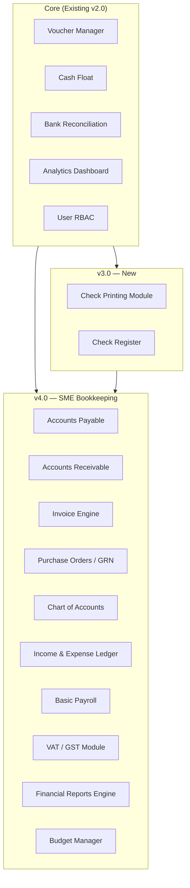
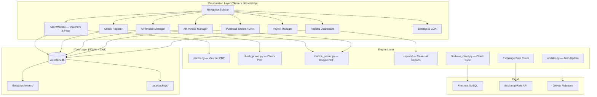
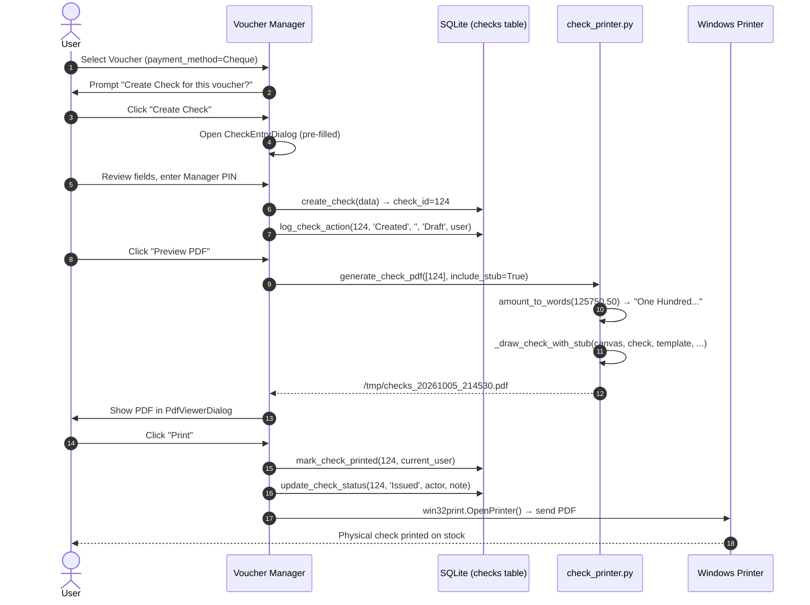
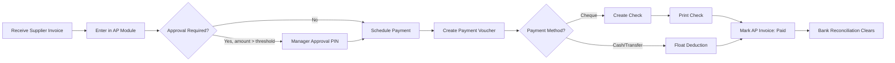

# 🏦 Voucher Manager — Check Printing Feature Blueprint & SME Bookkeeping Expansion Guide

> **Document Version**: 1.0 — October 2026  
> **Target App Version**: v3.0 (Check Printing) → v4.0 (Full SME Bookkeeping)  
> **Repository**: [praneeththilina/voucher](https://github.com/praneeththilina/voucher)  
> **Current State**: Voucher Manager v2.0 — Multi-currency, Firebase sync, RBAC, analytics, voucher PDF printing  

---

## Table of Contents

1. [Current System Baseline](#1-current-system-baseline)  
2. [Part A — Check Printing Feature](#2-part-a--check-printing-feature)  
   - 2.1 [Brainstorming & Requirements](#21-brainstorming--requirements)  
   - 2.2 [Database Schema Extensions](#22-database-schema-extensions)  
   - 2.3 [Check Layout Design Blueprint](#23-check-layout-design-blueprint)  
   - 2.4 [PDF Generation Engine — `check_printer.py`](#24-pdf-generation-engine--check_printerpy)  
   - 2.5 [UI Components — Check Entry Dialog](#25-ui-components--check-entry-dialog)  
   - 2.6 [Check Register & List View](#26-check-register--list-view)  
   - 2.7 [Security, Approval & Audit Controls](#27-security-approval--audit-controls)  
   - 2.8 [MICR Encoding (Optional Advanced)](#28-micr-encoding-optional-advanced)  
   - 2.9 [Check Stock Configuration Dialog](#29-check-stock-configuration-dialog)  
   - 2.10 [Integration with Existing Voucher Workflow](#210-integration-with-existing-voucher-workflow)  
   - 2.11 [Migration Plan — Additive Schema v3](#211-migration-plan--additive-schema-v3)  
   - 2.12 [Technical Implementation Checklist](#212-technical-implementation-checklist)  
3. [Part B — SME Simple Bookkeeping Expansion](#3-part-b--sme-simple-bookkeeping-expansion)  
   - 3.1 [Vision & Scope](#31-vision--scope)  
   - 3.2 [Module Architecture (v3 → v4)](#32-module-architecture-v3--v4)  
   - 3.3 [General Ledger & Double-Entry Bookkeeping](#33-general-ledger--double-entry-bookkeeping)  
   - 3.4 [Accounts Payable Module](#34-accounts-payable-module)  
   - 3.5 [Accounts Receivable & Invoicing Module](#35-accounts-receivable--invoicing-module)  
   - 3.6 [Purchase Orders & GRN Module](#36-purchase-orders--grn-module)  
   - 3.7 [Payroll & Employee Expense Claims](#37-payroll--employee-expense-claims)  
   - 3.8 [Financial Reporting Engine](#38-financial-reporting-engine)  
   - 3.9 [Tax Management (VAT / GST)](#39-tax-management-vat--gst)  
   - 3.10 [Expanded Database Schema](#310-expanded-database-schema)  
   - 3.11 [Cloud Sync Strategy for Bookkeeping](#311-cloud-sync-strategy-for-bookkeeping)  
   - 3.12 [UI/UX Architecture for Bookkeeping Modules](#312-uiux-architecture-for-bookkeeping-modules)  
   - 3.13 [Phased Implementation Roadmap](#313-phased-implementation-roadmap)  
   - 3.14 [Technical Stack Additions](#314-technical-stack-additions)  
   - 3.15 [Data Migration & Backward Compatibility](#315-data-migration--backward-compatibility)  
   - 3.16 [Testing Strategy](#316-testing-strategy)  
   - 3.17 [Build & Distribution Updates](#317-build--distribution-updates)  
4. [Architecture Diagrams](#4-architecture-diagrams)  
5. [Complete File & Module Map (v4.0)](#5-complete-file--module-map-v40)  

---

## 1. Current System Baseline

### What is Already Built (v2.0)

The Voucher Manager v2.0 is a mature, well-architected Python desktop app. Before adding any new feature, understand what already exists so no duplication occurs and all new code integrates cleanly.

| Component | File | Current Capability |
|---|---|---|
| **Entry Point** | `main.py` | Initializes DB, launches app |
| **App Bootstrap** | `app.py` | ttkbootstrap theme, DPI config |
| **Database Engine** | `database.py` (7,961 lines) | SQLite CRUD, 20+ migrations, backups |
| **PDF/Print Engine** | `printer.py` (1,043 lines) | 2-per-A4 voucher PDF, attachment packing |
| **Main UI** | `ui/main_window.py` (150 KB) | 4-tab layout, voucher list, entry form |
| **Dialogs** | `ui/dialogs.py` (83 KB) | PDF viewer, update dialogs |
| **Settings** | `ui/settings_dialog.py` (66 KB) | Company profiles, logo, numbering |
| **Float Manager** | `ui/float_manager.py` (85 KB) | Multi-drawer cash float tracking |
| **Analytics** | `ui/analytics_dashboard.py` | Charts, reports, CSV export |
| **Firebase Sync** | `firebase_client.py` (68 KB) | Real-time multi-terminal sync |
| **Updater** | `updater.py` | GitHub auto-update with batch swap |

### Current Database Schema — 20 Active Tables

```
vouchers, line_items, attachments, memos, companies,
people, categories, tags, voucher_tags, money_floats,
float_transactions, audit_logs, schema_migrations,
voucher_templates, template_line_items, currencies,
exchange_rates, approvers, users, app_settings,
bank_accounts, bank_transactions
```

### Current Voucher Printing Engine Summary

`printer.py` already implements:
- `generate_voucher_pdf(voucher_ids, output_path)` — 2 vouchers per A4
- `_draw_voucher(c, vdata, y_offset)` — full voucher layout with logo, header, line items table, signature lines
- `_draw_wrapped_text(c, text, x, y, max_w, ...)` — word-wrap engine
- `_render_attachments(c, all_attachments)` — smart packing (2-per-page or 4-grid)
- `_render_pdf_attachment(c, attachment)` — pypdfium2 rasterization for PDF attachments
- `_is_small_attachment(att)` — receipt slot detection (≤1.35MP = small)
- `_prepare_image_for_pdf(pil_img)` — transparency compositing for clean rendering

---

## 2. Part A — Check Printing Feature

### 2.1 Brainstorming & Requirements

#### 2.1.1 Why Check Printing for SMEs?

Despite digital payment growth, bank checks (cheques) remain a primary B2B payment instrument in Sri Lanka, South Asia, and many emerging markets. SMEs need:
- **Formal audit trail** for check payments tied to specific vouchers
- **Consistent, professional check presentation** to banks and vendors
- **Protection against check fraud** (correct alignment, authorized signatures)
- **Check register** to track issued, cleared, bounced, and voided checks
- **Bank reconciliation** linkage (already exists in v2.0)

#### 2.1.2 Core Feature Requirements

**Must-Have (v3.0 MVP)**
1. Define check stock templates per bank account (field positions, dimensions)
2. Create checks linked to existing payment vouchers
3. Print checks to pre-printed check stock (exact mm positioning)
4. Check register — list all issued checks with status tracking
5. Mark checks as: Issued, Presented, Cleared, Bounced, Voided, Post-Dated
6. Sequence number auto-generation within each bank account's check series
7. Amount in words (LKR/multi-currency) engine
8. Admin-only void and purge controls
9. Audit log for every check state change
10. RBAC enforcement (Cashier+ can create, Manager+ can void)

**Should-Have (v3.1)**
11. Batch check printing (multiple checks in one print run)
12. Check stub printing (for record-keeping copy retained by payer)
13. PDF preview before printing (using existing `pdf_viewer.py`)
14. Post-dated check reminder alerts in Alert Center
15. Integration with bank reconciliation — mark check as reconciled
16. Firebase cloud sync for check register

**Could-Have (v3.2)**
17. MICR E-13B font line encoding (for check readers)
18. Signature image overlay (digitally print scanned signature)
19. Check printing via Windows printer driver (not just PDF)
20. QR code on check stub linking back to voucher

---

### 2.2 Database Schema Extensions

All new tables use additive-only migration strategy (appended to `run_migrations()` in `database.py`). No existing tables are modified destructively.

#### New Table: `bank_check_templates`

Defines the physical layout of the check stock for each bank.

```sql
CREATE TABLE IF NOT EXISTS bank_check_templates (
    id          INTEGER PRIMARY KEY AUTOINCREMENT,
    company_id  INTEGER NOT NULL DEFAULT 1,
    bank_name   TEXT    NOT NULL,             -- e.g. "Commercial Bank", "HNB", "BOC"
    account_id  INTEGER,                      -- FK to bank_accounts (existing table)
    account_number TEXT DEFAULT '',
    branch_name TEXT DEFAULT '',
    
    -- Physical stock dimensions (in mm)
    page_width_mm   REAL NOT NULL DEFAULT 210.0,  -- Usually A4 width
    page_height_mm  REAL NOT NULL DEFAULT 90.0,   -- Check slip height portion
    
    -- Field positions (x, y from BOTTOM-LEFT corner, in mm)
    -- Each field: x_mm, y_mm, max_width_mm
    payee_x         REAL NOT NULL DEFAULT 45.0,
    payee_y         REAL NOT NULL DEFAULT 52.0,
    payee_max_w     REAL NOT NULL DEFAULT 120.0,
    
    amount_box_x    REAL NOT NULL DEFAULT 150.0,
    amount_box_y    REAL NOT NULL DEFAULT 52.0,
    amount_box_w    REAL NOT NULL DEFAULT 45.0,
    
    amount_words_x  REAL NOT NULL DEFAULT 10.0,
    amount_words_y  REAL NOT NULL DEFAULT 40.0,
    amount_words_max_w REAL NOT NULL DEFAULT 165.0,
    
    date_x          REAL NOT NULL DEFAULT 155.0,
    date_y          REAL NOT NULL DEFAULT 68.0,
    
    -- Signature line positions (up to 2 signatories)
    sig1_x          REAL NOT NULL DEFAULT 120.0,
    sig1_y          REAL NOT NULL DEFAULT 12.0,
    sig2_x          REAL NOT NULL DEFAULT 155.0,
    sig2_y          REAL NOT NULL DEFAULT 12.0,
    
    -- Company name / "Pay to the order of" static text positions
    company_x       REAL NOT NULL DEFAULT 10.0,
    company_y       REAL NOT NULL DEFAULT 68.0,
    
    -- Starting check number in series
    check_series_start  INTEGER NOT NULL DEFAULT 1,
    check_series_prefix TEXT    DEFAULT '',         -- e.g. "CB-" → "CB-00001"
    
    -- Optional: print company name on check
    print_company_name  INTEGER DEFAULT 1,
    print_company_logo  INTEGER DEFAULT 0,          -- risky — usually pre-printed
    
    notes       TEXT DEFAULT '',
    is_active   INTEGER DEFAULT 1,
    created_at  TIMESTAMP DEFAULT CURRENT_TIMESTAMP,
    updated_at  TIMESTAMP DEFAULT CURRENT_TIMESTAMP,
    
    FOREIGN KEY (company_id)  REFERENCES companies(id),
    FOREIGN KEY (account_id)  REFERENCES bank_accounts(id)
);
```

#### New Table: `checks`

The core check register. Each row is one issued check.

```sql
CREATE TABLE IF NOT EXISTS checks (
    id              INTEGER PRIMARY KEY AUTOINCREMENT,
    company_id      INTEGER NOT NULL DEFAULT 1,
    voucher_id      INTEGER,                    -- FK to vouchers (nullable for standalone)
    template_id     INTEGER NOT NULL,           -- FK to bank_check_templates
    
    -- Check Identity
    check_number    TEXT    NOT NULL,           -- e.g. "000123" or "CB-00001"
    check_series    INTEGER NOT NULL DEFAULT 1, -- sequential integer within template
    
    -- Payment Details
    payee_name      TEXT    NOT NULL,
    payee_address   TEXT    DEFAULT '',
    amount          REAL    NOT NULL,
    currency        TEXT    DEFAULT 'LKR',
    exchange_rate   REAL    DEFAULT 1.0,
    base_amount     REAL    NOT NULL,           -- always in company base currency
    amount_words    TEXT    NOT NULL,           -- e.g. "Fifty Thousand Only"
    
    -- Dates
    check_date      TEXT    NOT NULL,           -- date printed on check (YYYY-MM-DD)
    post_date       TEXT    DEFAULT '',         -- if post-dated, the future clearing date
    issued_date     TEXT    NOT NULL,           -- when physically issued (YYYY-MM-DD)
    cleared_date    TEXT    DEFAULT '',
    
    -- Status Lifecycle
    -- States: 'Draft' → 'Issued' → 'Presented' → 'Cleared'
    --                              ↘ 'Bounced'
    --         'Draft'  → 'Voided'
    --         'Issued' → 'Voided' (requires Manager PIN)
    status          TEXT    NOT NULL DEFAULT 'Draft',
    
    -- Authorization
    prepared_by     TEXT    DEFAULT '',
    authorized_by   TEXT    DEFAULT '',         -- Manager/Admin who approved printing
    authorized_at   TIMESTAMP DEFAULT NULL,
    
    -- Print tracking
    printed         INTEGER DEFAULT 0,
    printed_at      TIMESTAMP DEFAULT NULL,
    printed_by      TEXT    DEFAULT '',
    print_count     INTEGER DEFAULT 0,          -- how many times printed
    
    -- Bank reconciliation linkage
    bank_account_id INTEGER DEFAULT NULL,       -- FK to bank_accounts
    reconciled      INTEGER DEFAULT 0,
    reconciled_at   TIMESTAMP DEFAULT NULL,
    
    -- Bounce tracking
    bounce_reason   TEXT    DEFAULT '',
    bounce_date     TEXT    DEFAULT '',
    bounced_by      TEXT    DEFAULT '',         -- bank/teller who informed
    
    -- Memo & reference
    memo            TEXT    DEFAULT '',
    payment_ref     TEXT    DEFAULT '',         -- internal reference
    
    created_at      TIMESTAMP DEFAULT CURRENT_TIMESTAMP,
    updated_at      TIMESTAMP DEFAULT CURRENT_TIMESTAMP,
    
    UNIQUE(company_id, template_id, check_number),
    
    FOREIGN KEY (company_id)      REFERENCES companies(id),
    FOREIGN KEY (voucher_id)      REFERENCES vouchers(id) ON DELETE SET NULL,
    FOREIGN KEY (template_id)     REFERENCES bank_check_templates(id),
    FOREIGN KEY (bank_account_id) REFERENCES bank_accounts(id)
);
```

#### New Table: `check_audit_log`

Every status change, print, void, bounce is immutably logged.

```sql
CREATE TABLE IF NOT EXISTS check_audit_log (
    id          INTEGER PRIMARY KEY AUTOINCREMENT,
    check_id    INTEGER NOT NULL,
    company_id  INTEGER NOT NULL DEFAULT 1,
    action      TEXT    NOT NULL,   -- 'Created', 'Printed', 'Issued', 'Presented',
                                    --  'Cleared', 'Bounced', 'Voided', 'Reprinted'
    old_status  TEXT    DEFAULT '',
    new_status  TEXT    DEFAULT '',
    actor       TEXT    DEFAULT '', -- username who performed action
    note        TEXT    DEFAULT '',
    created_at  TIMESTAMP DEFAULT CURRENT_TIMESTAMP,
    
    FOREIGN KEY (check_id) REFERENCES checks(id) ON DELETE CASCADE
);
```

#### New Table: `check_signatories`

Stores up to 2 authorized signatories per check template (optionally with signature image).

```sql
CREATE TABLE IF NOT EXISTS check_signatories (
    id              INTEGER PRIMARY KEY AUTOINCREMENT,
    template_id     INTEGER NOT NULL,
    signatory_order INTEGER NOT NULL DEFAULT 1,  -- 1 = primary, 2 = secondary
    name            TEXT    NOT NULL,
    title           TEXT    DEFAULT '',           -- e.g. "Director Finance"
    signature_image BLOB    DEFAULT NULL,         -- scanned signature PNG
    is_active       INTEGER DEFAULT 1,
    
    FOREIGN KEY (template_id) REFERENCES bank_check_templates(id) ON DELETE CASCADE
);
```

#### Performance Indexes for Check Tables

```sql
CREATE INDEX IF NOT EXISTS idx_checks_company_date
    ON checks (company_id, check_date DESC);

CREATE INDEX IF NOT EXISTS idx_checks_company_status
    ON checks (company_id, status);

CREATE INDEX IF NOT EXISTS idx_checks_voucher
    ON checks (voucher_id);

CREATE INDEX IF NOT EXISTS idx_checks_template
    ON checks (template_id, check_series DESC);

CREATE INDEX IF NOT EXISTS idx_check_audit_check
    ON check_audit_log (check_id, created_at DESC);

CREATE INDEX IF NOT EXISTS idx_check_templates_comp
    ON bank_check_templates (company_id, is_active);
```

---

### 2.3 Check Layout Design Blueprint

#### 2.3.1 Standard Check Physical Dimensions

Sri Lankan commercial bank checks (and most Commonwealth-standard checks) follow these standard physical parameters:

| Bank | Width | Height | Notes |
|---|---|---|---|
| Commercial Bank (CB) | 210mm (A4 width) | 85-92mm | Pre-printed stock |
| Hatton National Bank (HNB) | 210mm | 88mm | Pre-printed stock |
| Bank of Ceylon (BOC) | 210mm | 86mm | Pre-printed stock |
| Sampath Bank | 210mm | 90mm | Pre-printed stock |
| Peoples Bank | 210mm | 88mm | Pre-printed stock |

> **Critical Design Constraint**: The printed output must align **exactly** with the pre-printed fields on the physical check stock. ALL x/y coordinates in the template are configurable in millimeters and calibrated per-bank.

#### 2.3.2 Standard Field Layout (Reference Coordinates)

```
┌─────────────────────────────────────────────────────────────────────────────────┐  ← y=90mm
│  [BANK LOGO pre-printed]               Date: ___/___/____                       │  ← y=70mm
│                                                                                 │
│  Pay to the Order of: ________________________________     LKR ___,___,___.___  │  ← y=54mm
│                                                                                 │
│  Amount in Words: ___________________________________________________           │  ← y=42mm
│                   ___________________________________________________           │  ← y=35mm
│                                                                                 │
│  _______________________________________________________________   MICR Line   │  ← y=10mm
│                                                                                 │
│  ____________________________    ____________________________                   │  ← y=12mm
│     Authorized Signatory 1           Authorized Signatory 2                    │
└─────────────────────────────────────────────────────────────────────────────────┘  ← y=0mm
  x=0mm                                                                     x=210mm
```

#### 2.3.3 Check Stub (Retention Copy)

The check stub is an adjacent or separate A4 half-page that retains:
- Check number, date, amount, payee
- Voucher reference number
- Authorized by / Prepared by
- Any memo or reference notes

This can be printed alongside the check on the same A4 sheet (stub left, check right) or as a separate A5 document.

---

### 2.4 PDF Generation Engine — `check_printer.py`

Create a new file `check_printer.py` alongside `printer.py`. This separation keeps concerns clean and avoids bloating the existing `printer.py`.

#### 2.4.1 File Structure

```python
"""
check_printer.py
Check Printing Engine for Voucher Manager v3.0.

Handles:
- Amount-to-words conversion (LKR, multi-currency)
- Millimeter-accurate check field rendering onto pre-printed stock
- Check stub generation
- Batch check PDF compilation
- Optional MICR font line rendering
"""

import os
import io
import tempfile
from datetime import datetime
from reportlab.pdfgen import canvas
from reportlab.lib.units import mm
from reportlab.lib import colors
from reportlab.lib.pagesizes import A4
import database as db
```

#### 2.4.2 Amount-to-Words Engine (LKR)

```python
def amount_to_words(amount: float, currency: str = "LKR") -> str:
    """
    Convert a numeric amount to a formal check-ready English words string.
    
    Handles amounts up to 999,999,999.99 (LKR or equivalent).
    Includes cents/decimal part with "and XX/100" notation.
    
    Args:
        amount: Float amount (e.g. 125750.50)
        currency: Currency code — adjusts denomination names
        
    Returns:
        str: e.g. "One Hundred Twenty-Five Thousand Seven Hundred Fifty and 50/100"
    
    Examples:
        amount_to_words(50000.00)  →  "Fifty Thousand Only"
        amount_to_words(125750.50) →  "One Hundred Twenty-Five Thousand 
                                       Seven Hundred Fifty and 50/100"
        amount_to_words(1000000)   →  "One Million Only"
    """
    ONES = [
        '', 'One', 'Two', 'Three', 'Four', 'Five',
        'Six', 'Seven', 'Eight', 'Nine', 'Ten', 'Eleven',
        'Twelve', 'Thirteen', 'Fourteen', 'Fifteen', 'Sixteen',
        'Seventeen', 'Eighteen', 'Nineteen'
    ]
    TENS = [
        '', '', 'Twenty', 'Thirty', 'Forty', 'Fifty',
        'Sixty', 'Seventy', 'Eighty', 'Ninety'
    ]

    def _say_below_thousand(n: int) -> str:
        if n == 0:
            return ''
        elif n < 20:
            return ONES[n]
        elif n < 100:
            tens = TENS[n // 10]
            ones = ONES[n % 10]
            return f"{tens}-{ones}".rstrip('-') if ones else tens
        else:
            hundreds = ONES[n // 100]
            remainder = _say_below_thousand(n % 100)
            return f"{hundreds} Hundred {remainder}".strip()

    # Split integer and decimal
    int_part = int(amount)
    dec_part = round((amount - int_part) * 100)

    if int_part == 0 and dec_part == 0:
        return "Zero Only"

    parts = []
    billions  = int_part // 1_000_000_000
    millions  = (int_part % 1_000_000_000) // 1_000_000
    thousands = (int_part % 1_000_000) // 1_000
    remainder = int_part % 1_000

    if billions:
        parts.append(f"{_say_below_thousand(billions)} Billion")
    if millions:
        parts.append(f"{_say_below_thousand(millions)} Million")
    if thousands:
        parts.append(f"{_say_below_thousand(thousands)} Thousand")
    if remainder:
        parts.append(_say_below_thousand(remainder))

    words = " ".join(parts).strip()

    if dec_part > 0:
        return f"{words} and {dec_part:02d}/100"
    else:
        return f"{words} Only"
```

#### 2.4.3 Core Check PDF Renderer

```python
def generate_check_pdf(
    check_ids: list[int],
    output_path: str = None,
    include_stub: bool = True
) -> str:
    """
    Generate a print-ready PDF for one or more checks.
    
    Each check is printed on its own page (or A4 half if stubs are included).
    The page size matches the physical check stock dimensions defined in 
    the bank_check_template associated with each check.
    
    Args:
        check_ids:     List of check IDs from the `checks` table.
        output_path:   Optional output file path. Defaults to temp file.
        include_stub:  If True, prints a retention stub alongside each check.
    
    Returns:
        str: Absolute path to the generated PDF.
    
    Raises:
        ValueError: If check_ids is empty or any check is in 'Voided' status.
    """
    if not output_path:
        output_path = os.path.join(
            tempfile.gettempdir(),
            f"checks_{datetime.now().strftime('%Y%m%d_%H%M%S')}.pdf"
        )

    conn = db.get_connection()
    try:
        checks_data = db.get_checks_full_by_ids(check_ids, conn=conn)
    finally:
        conn.close()

    if not checks_data:
        raise ValueError("No valid check data found for the given IDs.")

    # Use A4 as page size for compatibility; actual check area is a subset
    c = canvas.Canvas(output_path, pagesize=A4)

    for check_data in checks_data:
        check = check_data['check']
        template = check_data['template']
        company = check_data['company']
        signatories = check_data.get('signatories', [])

        if check['status'] == 'Voided':
            _draw_voided_page(c, check, template)
        else:
            if include_stub:
                _draw_check_with_stub(c, check, template, company, signatories)
            else:
                _draw_check_only(c, check, template, company, signatories)

        c.showPage()

    c.save()
    return output_path
```

#### 2.4.4 Check Field Renderer

```python
def _draw_check_only(c, check: dict, template: dict, company: dict, signatories: list):
    """
    Draw a single check onto the canvas, aligned to the pre-printed check stock.
    
    CRITICAL ALIGNMENT PRINCIPLE:
    - All coordinates are in MILLIMETERS from the bottom-left of the physical check.
    - The physical check is placed at the bottom of the A4 page (0,0 origin).
    - No background is drawn — text overlays the pre-printed fields only.
    - Font: Helvetica (safe, universally available, clean on bank check stock)
    """
    
    # Template field positions (all in mm, converted to points via * mm)
    px  = template['payee_x']
    py  = template['payee_y']
    pmw = template['payee_max_w']

    ax  = template['amount_box_x']
    ay  = template['amount_box_y']

    wx  = template['amount_words_x']
    wy  = template['amount_words_y']
    wmw = template['amount_words_max_w']

    dx  = template['date_x']
    dy  = template['date_y']

    # --- Payee Name ---
    c.setFont("Helvetica-Bold", 10)
    c.setFillColor(colors.black)
    payee = check['payee_name']
    # Truncate if too wide for the payee field
    while c.stringWidth(payee, "Helvetica-Bold", 10) > pmw * mm and len(payee) > 5:
        payee = payee[:-1]
    if payee != check['payee_name']:
        payee = payee[:-3] + "..."
    c.drawString(px * mm, py * mm, payee)

    # --- Amount (numeric) ---
    # Format: 125,750.50
    amt_str = f"{check['amount']:,.2f}"
    c.setFont("Helvetica-Bold", 11)
    c.drawRightString((ax + template['amount_box_w']) * mm, ay * mm, amt_str)

    # --- Amount in Words ---
    words = check.get('amount_words') or amount_to_words(check['amount'], check.get('currency', 'LKR'))
    c.setFont("Helvetica", 9)
    # Word-wrap the amount-in-words across up to 2 lines
    _draw_check_wrapped_text(c, words, wx * mm, wy * mm, wmw * mm, font_size=9)

    # --- Date ---
    # Format as DD/MM/YYYY for Commonwealth-standard checks
    try:
        dt = datetime.strptime(check['check_date'], "%Y-%m-%d")
        date_str = dt.strftime("%d/%m/%Y")
    except Exception:
        date_str = check['check_date']
    c.setFont("Helvetica", 9)
    c.drawString(dx * mm, dy * mm, date_str)

    # --- Signatories ---
    for sig in signatories:
        sx = template.get(f"sig{sig['signatory_order']}_x", 120.0)
        sy = template.get(f"sig{sig['signatory_order']}_y", 12.0)
        
        # If a scanned signature image is stored, overlay it
        if sig.get('signature_image'):
            _draw_signature_image(c, sig['signature_image'], sx * mm, sy * mm)
        
        c.setFont("Helvetica", 7)
        c.drawString(sx * mm, (sy - 3) * mm, sig['name'])
        if sig.get('title'):
            c.drawString(sx * mm, (sy - 6) * mm, sig['title'])

    # --- "VOID" watermark for safety on draft checks ---
    if check['status'] == 'Draft':
        c.setFillColor(colors.Color(0.9, 0.9, 0.9))
        c.setFont("Helvetica-Bold", 48)
        c.saveState()
        c.translate(105 * mm, 45 * mm)
        c.rotate(25)
        c.drawCentredString(0, 0, "DRAFT")
        c.restoreState()
        c.setFillColor(colors.black)
```

#### 2.4.5 Check Stub Renderer

```python
def _draw_check_with_stub(c, check, template, company, signatories):
    """
    Draw check stub (left/top half of A4) and the check (right/bottom).
    
    Stub Layout:
    ┌────────────────────────────────────┐
    │ [STUB - Retention Copy]            │
    │ Check #: CB-000123                 │
    │ Date: 05/10/2026                   │
    │ Pay To: ABC Suppliers Pvt Ltd      │
    │ Amount: LKR 125,750.50             │
    │ In Words: One Hundred...           │
    │ Voucher: V-2026-0145               │
    │ Prepared By: Kamal Perera          │
    │ Authorized By: Nimal Silva         │
    │ Memo: October Supplier Payment     │
    ├ ─ ─ ─ ─ ─ ─ ─ ─ ─ ─ ─ ─ ─ ─ ─ ┤  ← cut line
    │ [CHECK - Submit to Bank]           │
    │ (pre-printed fields overlay)       │
    └────────────────────────────────────┘
    """
    PAGE_HEIGHT = A4[1]
    STUB_HEIGHT = PAGE_HEIGHT / 2
    
    # Draw stub (top half)
    _draw_check_stub(c, check, company, y_origin=STUB_HEIGHT)
    
    # Draw cut line
    c.setStrokeColor(colors.grey)
    c.setDash(5, 3)
    c.line(15 * mm, STUB_HEIGHT, A4[0] - 15 * mm, STUB_HEIGHT)
    c.setDash()
    c.setFont("Helvetica", 6)
    c.setFillColor(colors.grey)
    c.drawCentredString(A4[0] / 2, STUB_HEIGHT + 1 * mm, "— cut here —")
    
    # Draw check (bottom half of A4 = actual check stock area)
    _draw_check_only(c, check, template, company, signatories)


def _draw_check_stub(c, check: dict, company: dict, y_origin: float):
    """Render the retention stub in the upper half of the page."""
    from reportlab.lib.units import mm
    
    x = 15 * mm
    y = y_origin - 10 * mm
    line_h = 5.5 * mm

    # Stub header
    c.setFillColor(colors.HexColor("#1e3a8a"))
    c.setFont("Helvetica-Bold", 10)
    c.drawString(x, y, f"CHECK STUB — {company.get('name', '')}")
    c.setFillColor(colors.HexColor("#94a3b8"))
    c.setFont("Helvetica", 7)
    c.drawRightString(A4[0] - 15 * mm, y, "RETENTION COPY")
    y -= line_h * 1.5

    # Divider
    c.setStrokeColor(colors.HexColor("#334155"))
    c.setLineWidth(0.5)
    c.line(x, y, A4[0] - 15 * mm, y)
    y -= line_h

    def _row(label: str, value: str):
        nonlocal y
        c.setFont("Helvetica-Bold", 8)
        c.setFillColor(colors.HexColor("#334155"))
        c.drawString(x, y, f"{label}:")
        c.setFont("Helvetica", 8.5)
        c.setFillColor(colors.black)
        c.drawString(x + 38 * mm, y, str(value))
        y -= line_h

    _row("Check No.", check.get("check_number", ""))
    _row("Check Date", check.get("check_date", ""))
    
    if check.get("post_date"):
        _row("Post-Dated", check["post_date"])
    
    _row("Pay To", check.get("payee_name", ""))
    
    currency = check.get("currency", "LKR")
    _row("Amount", f"{currency} {check.get('amount', 0):,.2f}")
    _row("In Words", check.get("amount_words", ""))
    
    if check.get("voucher_number"):
        _row("Voucher Ref.", check["voucher_number"])
    if check.get("memo"):
        _row("Memo", check["memo"])
    if check.get("payment_ref"):
        _row("Payment Ref.", check["payment_ref"])
    
    y -= line_h * 0.5
    c.line(x, y, A4[0] - 15 * mm, y)
    y -= line_h

    _row("Prepared By", check.get("prepared_by", ""))
    _row("Authorized By", check.get("authorized_by", ""))
    _row("Status", check.get("status", "Issued"))
    _row("Printed", datetime.now().strftime("%d/%m/%Y %H:%M"))
```

#### 2.4.6 Helper: Check-Wrapped Text

```python
def _draw_check_wrapped_text(
    c, text: str, x: float, y: float, max_w: float,
    font_name: str = "Helvetica", font_size: int = 9,
    line_gap: float = 4.5 * mm, max_lines: int = 3
) -> float:
    """
    Wrap text across multiple lines within a given width.
    Identical contract to printer.py::_draw_wrapped_text but
    parameterized for check fields (max_lines guard, returns final y).
    """
    c.setFont(font_name, font_size)
    words = text.split()
    lines, curr = [], ""
    for w in words:
        test = f"{curr} {w}".strip()
        if c.stringWidth(test, font_name, font_size) <= max_w:
            curr = test
        else:
            if curr:
                lines.append(curr)
            curr = w
            if len(lines) >= max_lines - 1:
                break
    if curr:
        lines.append(curr)
    
    cur_y = y
    for line in lines[:max_lines]:
        c.drawString(x, cur_y, line)
        cur_y -= line_gap
    return cur_y
```

---

### 2.5 UI Components — Check Entry Dialog

#### 2.5.1 `ui/check_dialog.py` — New File

```
ui/check_dialog.py
├── CheckEntryDialog        # Create / Edit a check
├── CheckPreviewDialog      # PDF preview before printing (wraps pdf_viewer.py)
└── CheckBounceDialog       # Record a bounce event with reason
```

#### CheckEntryDialog Layout Blueprint

```
┌──────────────────────────────────────────────────────────────────────────┐
│  ✏ Create Check Payment                           [Company: ABC Ltd]     │
├──────────────────────────────────────────────────────────────────────────┤
│  Bank Account:  [▼ Commercial Bank — 00023456789]                        │
│  Check #:       [Auto: CB-000124]      Date:  [05/10/2026 ▾]            │
│  Post-Dated:    [□] Post-date this check →  Post Date: [__/__/____]     │
├──────────────────────────────────────────────────────────────────────────┤
│  Link Voucher:  [🔗 V-2026-0145 — ABC Suppliers — LKR 125,750.50]  [✗]  │
├──────────────────────────────────────────────────────────────────────────┤
│  Pay To:        [ABC Suppliers Pvt Ltd                             ]     │
│  Address:       [No. 45, Galle Road, Colombo 03                    ]     │
├──────────────────────────────────────────────────────────────────────────┤
│  Amount:        [125,750.50]    Currency: [LKR ▾]                       │
│  In Words:      "One Hundred Twenty-Five Thousand Seven Hundred          │
│                  Fifty and 50/100" (auto-generated, editable)           │
├──────────────────────────────────────────────────────────────────────────┤
│  Memo:          [October 2026 — Hardware Supplies Invoice #INV-2209]    │
│  Ref No.:       [INV-2209]                                               │
├──────────────────────────────────────────────────────────────────────────┤
│  Authorized By: [▼ Nimal Silva (Manager)]  [Enter PIN: ●●●●]            │
├──────────────────────────────────────────────────────────────────────────┤
│                [Preview PDF]   [Save Draft]   [Save & Print]   [Cancel]  │
└──────────────────────────────────────────────────────────────────────────┘
```

**Key Behavior Notes:**
- Check number auto-increments from the last check in that template's series
- Linking a voucher auto-fills: `paid_to`, `amount`, `currency`, `payment_ref`
- Amount-in-words is auto-generated on amount change but user can edit
- PIN authorization required for `Save & Print` (Cashier+ role to create, Manager+ to authorize print)
- `Preview PDF` renders without saving — uses a temporary check record

---

### 2.6 Check Register & List View

#### 2.6.1 `ui/check_register.py` — New Tab or Modal

The Check Register is a dedicated view (either a new Tab 5, or a large dialog from the toolbar) with:

**Column Layout:**
```
│ Check # │ Bank Account │ Date │ Post-Date │ Payee │ Amount │ Status │ Voucher │ Printed │ Actions │
```

**Status Color Coding:**
| Status | Color | Badge |
|---|---|---|
| Draft | `#94a3b8` (grey) | DRAFT |
| Issued | `#2563eb` (blue) | ISSUED |
| Presented | `#f59e0b` (amber) | PRESENTED |
| Cleared | `#16a34a` (green) | CLEARED |
| Bounced | `#dc2626` (red) | BOUNCED |
| Voided | `#6b7280` (dark grey strikethrough) | VOID |
| Post-Dated | `#7c3aed` (purple) | POST-DATED |

**Toolbar Actions:**
- `[+ New Check]` — Open CheckEntryDialog
- `[Print Selected]` — Batch print selected checks
- `[Mark Presented]` — Mark as presented to bank
- `[Mark Cleared]` — Mark as cleared/paid
- `[Record Bounce]` — Open CheckBounceDialog
- `[Void Check]` — Requires Manager PIN
- `[Export CSV]` — Export check register

**Filters:**
- Date range picker
- Bank account dropdown
- Status filter (multi-select)
- Search by payee / check number

---

### 2.7 Security, Approval & Audit Controls

#### 2.7.1 RBAC Enforcement for Check Module

| Action | Minimum Role | Additional Requirement |
|---|---|---|
| View check register | Viewer | — |
| Create check (Draft) | Data Entry | — |
| Authorize check print | Cashier | Manager+ PIN |
| Print check | Cashier | Must be authorized |
| Reprint check | Manager | Reprint reason required |
| Mark Presented | Cashier | — |
| Mark Cleared | Cashier | — |
| Record Bounce | Manager | Reason required |
| Void check | Manager | PIN + reason required |
| Delete voided check | Admin | Admin password |
| Edit check template | Admin | — |

#### 2.7.2 Void Control Rules

```python
# Business rules for voiding a check:
# 1. Only Voided checks can be permanently deleted (same as voucher soft-cancel pattern)
# 2. Cleared checks CANNOT be voided (already settled with bank)
# 3. Bounced checks CAN be voided after recording bounce
# 4. Printed checks require Manager PIN to void
# 5. Void action is irreversible and creates an audit log entry

def can_void_check(check: dict, current_user: dict) -> tuple[bool, str]:
    """Returns (allowed, reason_if_denied)."""
    if check['status'] == 'Cleared':
        return False, "Cleared checks cannot be voided. Contact your bank."
    if check['status'] == 'Voided':
        return False, "Check is already voided."
    if current_user.get('role') not in ('Manager', 'Admin'):
        return False, "Only Manager or Admin role can void checks."
    return True, ""
```

#### 2.7.3 Audit Trail Integration

Every state change writes to `check_audit_log`:

```python
def log_check_action(check_id: int, action: str, old_status: str, 
                     new_status: str, actor: str, note: str = "",
                     conn=None) -> None:
    """
    Immutable audit log entry for a check lifecycle event.
    Called automatically by all check mutation functions in database.py.
    """
    close = conn is None
    conn = conn or get_connection()
    try:
        conn.execute("""
            INSERT INTO check_audit_log 
                (check_id, action, old_status, new_status, actor, note)
            VALUES (?, ?, ?, ?, ?, ?)
        """, (check_id, action, old_status, new_status, actor, note))
        conn.commit()
    finally:
        if close:
            conn.close()
```

---

### 2.8 MICR Encoding (Optional Advanced Feature)

**MICR** (Magnetic Ink Character Recognition) is the row of special characters printed at the bottom of bank checks that allow automated check processing.

#### 2.8.1 MICR E-13B Character Set

The MICR line on a standard check reads:
```
⑆ [check-number] ⑆ ⑈ [bank-routing/transit] ⑈ [account-number] ⑇
```

Special MICR control characters:
- `⑆` = Transit (separates routing number)
- `⑈` = On-us (separates account number)
- `⑇` = Amount (separates amount on some formats)
- `⑉` = Dash

#### 2.8.2 MICR Font Implementation

```python
# To implement MICR printing:
# 1. Embed the E-13B MICR font (freely available, e.g. from GnuMICR project)
# 2. Register it with ReportLab:

from reportlab.pdfbase import pdfmetrics
from reportlab.pdfbase.ttfonts import TTFont

def register_micr_font(font_path: str):
    """Register MICR E-13B font with ReportLab for check printing."""
    try:
        pdfmetrics.registerFont(TTFont("MICR-E13B", font_path))
        return True
    except Exception as e:
        print(f"MICR font registration failed: {e}")
        return False

def draw_micr_line(c, check: dict, template: dict):
    """
    Draw the MICR E-13B line at the bottom of the check.
    
    Format: ⑆CHECKNUM⑆ ⑈ROUTING⑈ ACCOUNT⑇
    
    CRITICAL: MICR must be printed with magnetic ink (MICR toner cartridge)
    for automated bank processing. Standard black ink may work for manual
    processing but not for automated check readers.
    """
    micr_y = 8 * mm  # 8mm from bottom (standard MICR baseline)
    micr_x = 15 * mm
    
    routing = template.get('routing_number', '000000000')
    account = template.get('account_number_micr', '')
    check_num = check.get('check_series', '0').zfill(4)
    
    micr_string = f"⑆{check_num}⑆ ⑈{routing}⑈ {account}⑇"
    
    c.setFont("MICR-E13B", 12)  # Standard MICR E-13B point size
    c.setFillColor(colors.black)
    c.drawString(micr_x, micr_y, micr_string)
```

> **⚠️ Warning**: MICR printing requires a MICR-certified toner cartridge. Without it, check scanners at banks may reject the check. For most SME use cases, the MICR line can be omitted and the pre-printed stock's own MICR line will be used. This feature should be presented as optional/advanced.

---

### 2.9 Check Stock Configuration Dialog

#### 2.9.1 `ui/check_template_dialog.py` — New File

This dialog (Admin-only) allows configuring the exact mm positions for each bank's check stock.

```
┌───────────────────────────────────────────────────────────────────┐
│  ⚙ Check Stock Template Configuration — Admin Only               │
├───────────────────────────────────────────────────────────────────┤
│  Template Name:     [Commercial Bank — Main Account              ]│
│  Bank Name:         [Commercial Bank of Ceylon PLC               ]│
│  Bank Account:      [▼ CB — 0023456789]                          │
│  Branch:            [Colombo Main Branch                         ]│
├───────────────────────────────────────────────────────────────────┤
│  Check Stock Dimensions (mm)                                      │
│  Width:  [210.0 mm]    Height: [88.0 mm]                         │
├───────────────────────────────────────────────────────────────────┤
│  Field Positions (X, Y from bottom-left in mm)                    │
│  Payee Line:    X [45.0]  Y [52.0]  Max Width [120.0]            │
│  Amount Box:    X [150.0] Y [52.0]  Width [45.0]                 │
│  Amount Words:  X [10.0]  Y [40.0]  Max Width [165.0]            │
│  Date Field:    X [155.0] Y [68.0]                               │
│  Signatory 1:   X [115.0] Y [12.0]                               │
│  Signatory 2:   X [155.0] Y [12.0]                               │
├───────────────────────────────────────────────────────────────────┤
│  Check Series                                                     │
│  Series Prefix: [CB-]   Starting #: [1]   Zero-Pad to: [6] digits│
│  Preview:  CB-000001, CB-000002, CB-000003 ...                   │
├───────────────────────────────────────────────────────────────────┤
│  Signatories                                                      │
│  [+ Add Signatory]                                               │
│  1. Nimal Silva — Director Finance    [Upload Signature] [✗]     │
│  2. Kamal Perera — CEO               [Upload Signature] [✗]     │
├───────────────────────────────────────────────────────────────────┤
│  [Test Print (Calibration Page)]   [Save Template]   [Cancel]    │
└───────────────────────────────────────────────────────────────────┘
```

**Test Print / Calibration Page:**
Prints a full-scale A4 calibration page with:
- Grid overlay (every 10mm)
- Labeled field markers ("PAYEE", "AMOUNT", "DATE", etc.)
- Coordinate annotations
- Hold the calibration printout behind the physical check stock against a light source to verify alignment

---

### 2.10 Integration with Existing Voucher Workflow

#### 2.10.1 Payment Method Extension

The `vouchers` table already has `payment_method` column (`Migration 4`). Currently supports: `Cash`, `Cheque`, `Bank Transfer`, `Online`.

When `payment_method = 'Cheque'`, the voucher list view should:
1. Show a `[🖨 Print Check]` action button on the row
2. Display a `🔗 Check #CB-000124` badge if a check is already linked
3. Allow jump to the check register from the voucher row

#### 2.10.2 Voucher→Check Quick Action Flow

```
User marks voucher payment_method = 'Cheque'
    ↓
App detects no check linked → Shows toast:
    "💡 Tip: Create a check payment for this voucher? [Create Check]"
    ↓
[Create Check] → Opens CheckEntryDialog pre-filled with voucher data
    ↓
User authorizes → Saves check → Links check_id back to voucher
    ↓
Voucher list row shows: ✅ Check CB-000124 linked
```

#### 2.10.3 Bank Reconciliation Integration

The existing `bank_reconciliation.py` currently matches CSV bank statement rows with vouchers. Extend it to also match against the `checks` table:

```python
# In bank_reconciliation.py matching engine:
# Priority 1: Match by check number (check_number appears in bank statement description)
# Priority 2: Match by amount + date within tolerance
# On match: Set checks.reconciled = 1, checks.status = 'Cleared', checks.cleared_date = statement_date
```

---

### 2.11 Migration Plan — Additive Schema v3

Append to `database.py::run_migrations()`:

```python
# Migration 21: Check Printing Module
if 21 not in applied:
    cursor.execute("""
        CREATE TABLE IF NOT EXISTS bank_check_templates (
            -- (full schema as documented in Section 2.2)
        );
    """)
    cursor.execute("""
        CREATE TABLE IF NOT EXISTS checks (
            -- (full schema as documented in Section 2.2)
        );
    """)
    cursor.execute("""
        CREATE TABLE IF NOT EXISTS check_audit_log (
            -- (full schema as documented in Section 2.2)
        );
    """)
    cursor.execute("""
        CREATE TABLE IF NOT EXISTS check_signatories (
            -- (full schema as documented in Section 2.2)
        );
    """)
    
    # All indexes from Section 2.2
    cursor.execute("CREATE INDEX IF NOT EXISTS idx_checks_company_date ON checks (company_id, check_date DESC)")
    cursor.execute("CREATE INDEX IF NOT EXISTS idx_checks_company_status ON checks (company_id, status)")
    cursor.execute("CREATE INDEX IF NOT EXISTS idx_checks_voucher ON checks (voucher_id)")
    cursor.execute("CREATE INDEX IF NOT EXISTS idx_checks_template ON checks (template_id, check_series DESC)")
    cursor.execute("CREATE INDEX IF NOT EXISTS idx_check_audit_check ON check_audit_log (check_id, created_at DESC)")
    
    cursor.execute("INSERT OR IGNORE INTO schema_migrations (version, name) VALUES (21, 'check_printing_module')")
```

> **Zero-Risk Guarantee**: Migration 21 is purely additive — no existing table is modified. Existing vouchers.db upgrades safely. The backup pipeline (`database.backup_database()`) runs automatically before migrations on every startup.

---

### 2.12 Technical Implementation Checklist

```
Phase 1 — Core Infrastructure (1-2 weeks)
  □ database.py: Add Migration 21 (all 4 check tables + indexes)
  □ database.py: Implement CRUD functions:
      □ create_check_template(data) → int (template_id)
      □ get_check_templates(company_id) → list
      □ get_next_check_number(template_id) → str
      □ create_check(data) → int (check_id)
      □ get_checks(company_id, filters) → list
      □ get_check_by_id(check_id) → dict
      □ get_checks_full_by_ids(ids) → list[dict]
      □ update_check_status(check_id, new_status, actor, note)
      □ void_check(check_id, actor, reason) → bool
      □ mark_check_printed(check_id, actor)
      □ log_check_action(...)
      □ get_check_audit_trail(check_id) → list
  □ check_printer.py: New file with all functions from Section 2.4
      □ amount_to_words(amount, currency) → str (with unit tests)
      □ generate_check_pdf(check_ids, output_path, include_stub) → str
      □ _draw_check_only(c, check, template, company, signatories)
      □ _draw_check_stub(c, check, company, y_origin)
      □ _draw_check_with_stub(c, check, template, company, signatories)
      □ _draw_voided_page(c, check, template)
      □ _draw_check_wrapped_text(...)

Phase 2 — UI Components (1-2 weeks)
  □ ui/check_template_dialog.py
      □ CheckTemplateListDialog (list/manage templates)
      □ CheckTemplateEditDialog (add/edit template)
      □ CalibrationPrintDialog (test print with grid)
  □ ui/check_dialog.py
      □ CheckEntryDialog (create/edit check)
      □ CheckBounceDialog (record bounce)
      □ CheckAuthDialog (PIN authorization wrapper)
  □ ui/check_register.py
      □ CheckRegisterFrame (filterable list view)
      □ CheckRegisterTab (if implementing as Tab 5)
      □ CheckStatusBadge widget

Phase 3 — Integration (0.5 weeks)
  □ ui/main_window.py: Add Tab 5 or toolbar button for Check Register
  □ ui/main_window.py: "Cheque" payment method → auto-prompt check creation
  □ ui/bank_reconciliation.py: Extend matching to include checks table
  □ ui/alert_center.py: Post-dated check reminder alerts
  □ firebase_client.py: Add check register sync (checks table)

Phase 4 — Testing & Polish (0.5 weeks)
  □ tests/test_check_printer.py:
      □ test_amount_to_words_whole()
      □ test_amount_to_words_with_cents()
      □ test_amount_to_words_millions()
      □ test_amount_to_words_zero()
      □ test_generate_check_pdf_single()
      □ test_generate_check_pdf_batch()
      □ test_check_migration_21()
  □ Manual calibration testing with physical check stock for each bank template
  □ RBAC enforcement verification across all check actions
```

---

## 3. Part B — SME Simple Bookkeeping Expansion

### 3.1 Vision & Scope

#### 3.1.1 The Transformation

Current state: **Payment Voucher Management Tool** (specialized)  
Target state: **SME Financial Operations Platform** (comprehensive)

The goal is NOT to build a full ERP. The goal is to build a **bookkeeping platform that covers 90% of what a typical 5–100 person SME needs** — lean, fast, offline-first, and extending the strong foundation already in place.

#### 3.1.2 Target SME Profile

- **Company size**: 5–100 employees
- **Revenue**: LKR 5M – 500M annually (or equivalent)
- **Industry**: Retail, trading, professional services, construction, hospitality
- **Accounting skill level**: Non-accountant business owners and bookkeepers
- **Tech literacy**: Moderate — comfortable with desktop software

#### 3.1.3 Bookkeeping Scope Boundary

```
IN SCOPE (v3.0 → v4.0):
  ✅ Payment vouchers (existing)
  ✅ Check printing (v3.0)
  ✅ Petty cash & float management (existing)
  ✅ Bank reconciliation (existing)
  ✅ Supplier invoices / Accounts Payable
  ✅ Customer invoices / Accounts Receivable
  ✅ Expense claims & employee reimbursements
  ✅ Purchase Orders & GRN
  ✅ Chart of Accounts (simplified)
  ✅ Income & Expense ledger
  ✅ Profit & Loss Statement
  ✅ VAT/GST tracking and reporting
  ✅ Payroll (basic salary processing)
  ✅ Budget vs Actual reporting

OUT OF SCOPE (remains in specialized accounting software):
  ❌ Balance Sheet (requires full double-entry GL implementation)
  ❌ Fixed Asset Depreciation schedules
  ❌ Inventory management (valuation: FIFO/LIFO/Weighted Avg)
  ❌ Complex payroll (EPF/ETF calculations for 100+ staff)
  ❌ Multi-currency consolidation across entities
  ❌ Statutory filing and e-filing APIs
```

---

### 3.2 Module Architecture (v3 → v4)

#### 3.2.1 New Modules Overview



#### 3.2.2 Tab Layout Evolution

**v2.0 Current — 4 Tabs:**
```
[Tab 1: Voucher List]  [Tab 2: Entry Form]  [Tab 3: Cash Float]  [Tab 4: Analytics]
```

**v3.0 — 5 Tabs:**
```
[Tab 1: Voucher List]  [Tab 2: Entry Form]  [Tab 3: Cash Float]  [Tab 4: Analytics]  [Tab 5: Checks]
```

**v4.0 — Ribbon/Module Switcher:**
```
[Sidebar Navigation]
├── 💳 Vouchers & Payments
│    ├── Voucher List
│    ├── New Voucher
│    ├── Check Register
│    └── Cash Float
├── 📄 Invoicing
│    ├── Customer Invoices (AR)
│    ├── Supplier Invoices (AP)
│    └── Purchase Orders
├── 📊 Accounts
│    ├── Chart of Accounts
│    ├── Income & Expense Ledger
│    └── Bank Reconciliation
├── 👥 Payroll
│    ├── Employee Records
│    └── Salary Processing
├── 📈 Reports
│    ├── Profit & Loss
│    ├── VAT/GST Return
│    ├── Cash Flow
│    └── Budget vs Actual
└── ⚙ Settings
```

For v4.0, the 4-tab layout should be replaced by a left-sidebar navigation panel (`NavigationSidebar` widget in `ui/main_window.py`).

---

### 3.3 General Ledger & Double-Entry Bookkeeping

#### 3.3.1 Simplified Chart of Accounts

For SME use, implement a **simplified 5-group chart of accounts**:

```
Chart of Accounts (Simplified)
├── 1000 — ASSETS
│    ├── 1100 — Cash & Bank
│    │    ├── 1110 — Petty Cash (Main Float)
│    │    ├── 1120 — Cash at Bank — CB
│    │    └── 1130 — Cash at Bank — HNB
│    ├── 1200 — Accounts Receivable
│    │    └── 1210 — Trade Debtors
│    └── 1300 — Prepaid Expenses
│
├── 2000 — LIABILITIES
│    ├── 2100 — Accounts Payable
│    │    └── 2110 — Trade Creditors
│    └── 2200 — Tax Liabilities
│         └── 2210 — VAT Payable
│
├── 3000 — EQUITY
│    └── 3100 — Owner's Equity / Retained Earnings
│
├── 4000 — INCOME / REVENUE
│    ├── 4100 — Sales Revenue
│    ├── 4200 — Service Revenue
│    └── 4300 — Other Income
│
└── 5000 — EXPENSES
     ├── 5100 — Salaries & Wages
     ├── 5200 — Rent
     ├── 5300 — Utilities
     ├── 5400 — Office Supplies
     ├── 5500 — Travel & Transport
     ├── 5600 — Marketing & Advertising
     ├── 5700 — Professional Fees
     └── 5800 — Bank Charges
```

#### 3.3.2 Journal Entry Structure

```sql
CREATE TABLE IF NOT EXISTS journal_entries (
    id          INTEGER PRIMARY KEY AUTOINCREMENT,
    company_id  INTEGER NOT NULL DEFAULT 1,
    entry_date  TEXT    NOT NULL,
    reference   TEXT    DEFAULT '',     -- voucher #, invoice #, etc.
    description TEXT    NOT NULL,
    entry_type  TEXT    NOT NULL,       -- 'Manual', 'Voucher', 'Invoice', 'Payroll', 'VAT'
    source_module TEXT  DEFAULT '',     -- 'voucher', 'ap_invoice', 'ar_invoice', 'payroll'
    source_id   INTEGER DEFAULT NULL,  -- ID from source table
    created_by  TEXT    DEFAULT '',
    created_at  TIMESTAMP DEFAULT CURRENT_TIMESTAMP,
    FOREIGN KEY (company_id) REFERENCES companies(id)
);

CREATE TABLE IF NOT EXISTS journal_lines (
    id              INTEGER PRIMARY KEY AUTOINCREMENT,
    entry_id        INTEGER NOT NULL,
    account_id      INTEGER NOT NULL,
    debit_amount    REAL    DEFAULT 0.0,
    credit_amount   REAL    DEFAULT 0.0,
    description     TEXT    DEFAULT '',
    FOREIGN KEY (entry_id)  REFERENCES journal_entries(id) ON DELETE CASCADE,
    FOREIGN KEY (account_id) REFERENCES chart_of_accounts(id)
);
```

#### 3.3.3 Auto-Journal Generation

When a user saves a payment voucher (existing workflow), the system should auto-create journal entries:

```python
def auto_journal_for_voucher(voucher_id: int, conn=None):
    """
    Auto-generate a balanced journal entry when a voucher is saved.
    
    Example — Voucher for Office Supplies paid in Cash:
    DEBIT:  5400 Office Supplies      LKR 5,000
    CREDIT: 1110 Petty Cash (Float)   LKR 5,000
    
    Example — Voucher for Rent paid via Bank Transfer:
    DEBIT:  5200 Rent Expense         LKR 75,000
    CREDIT: 1120 Cash at Bank — CB    LKR 75,000
    """
    voucher = get_voucher_by_id(voucher_id, conn=conn)
    line_items = get_line_items(voucher_id, conn=conn)
    
    # Determine credit account based on payment method
    payment_method = voucher.get('payment_method', 'Cash')
    credit_account = _get_payment_account(payment_method, voucher.get('float_id'), conn=conn)
    
    # One journal entry with multiple debit lines (one per line item)
    entry_id = create_journal_entry({
        'company_id':   voucher['company_id'],
        'entry_date':   voucher['date'],
        'reference':    voucher['voucher_number'],
        'description':  f"Payment to {voucher['paid_to']}",
        'entry_type':   'Voucher',
        'source_module': 'voucher',
        'source_id':    voucher_id,
        'created_by':   voucher.get('prepared_by', ''),
    }, conn=conn)
    
    for item in line_items:
        debit_account = _get_category_account(item.get('category'), conn=conn)
        add_journal_line(entry_id, debit_account, debit=item['amount'], conn=conn)
    
    add_journal_line(entry_id, credit_account, credit=voucher['total_amount'], conn=conn)
```

---

### 3.4 Accounts Payable Module

#### 3.4.1 AP Workflow

```
Receive Supplier Invoice
    → Enter in AP Module (supplier_invoices table)
    → Link to Purchase Order (optional)
    → Approval (if amount > threshold)
    → Schedule payment date
    → Create payment voucher (links AP invoice to voucher)
    → Create check or bank transfer
    → Mark invoice as PAID
    → Bank Reconciliation clears
```

#### 3.4.2 Database Schema

```sql
CREATE TABLE IF NOT EXISTS suppliers (
    id          INTEGER PRIMARY KEY AUTOINCREMENT,
    company_id  INTEGER NOT NULL DEFAULT 1,
    name        TEXT    NOT NULL,
    address     TEXT    DEFAULT '',
    phone       TEXT    DEFAULT '',
    email       TEXT    DEFAULT '',
    tax_id      TEXT    DEFAULT '',      -- VAT registration number
    payment_terms INTEGER DEFAULT 30,   -- net days
    bank_name   TEXT    DEFAULT '',
    bank_account TEXT   DEFAULT '',
    notes       TEXT    DEFAULT '',
    is_active   INTEGER DEFAULT 1,
    created_at  TIMESTAMP DEFAULT CURRENT_TIMESTAMP
);

CREATE TABLE IF NOT EXISTS ap_invoices (
    id              INTEGER PRIMARY KEY AUTOINCREMENT,
    company_id      INTEGER NOT NULL DEFAULT 1,
    supplier_id     INTEGER NOT NULL,
    invoice_number  TEXT    NOT NULL,   -- supplier's invoice number
    internal_ref    TEXT    DEFAULT '', -- your internal reference
    invoice_date    TEXT    NOT NULL,
    due_date        TEXT    NOT NULL,
    
    -- Amounts
    subtotal        REAL    NOT NULL DEFAULT 0,
    discount_amount REAL    DEFAULT 0,
    tax_amount      REAL    DEFAULT 0,  -- VAT amount
    total_amount    REAL    NOT NULL DEFAULT 0,
    paid_amount     REAL    DEFAULT 0,
    balance_due     REAL    GENERATED ALWAYS AS (total_amount - paid_amount) STORED,
    
    currency        TEXT    DEFAULT 'LKR',
    exchange_rate   REAL    DEFAULT 1.0,
    
    -- Status
    status          TEXT    DEFAULT 'Unpaid',
    -- 'Unpaid', 'Partially Paid', 'Paid', 'Overdue', 'Disputed', 'Cancelled'
    
    -- Links
    po_id           INTEGER DEFAULT NULL,   -- FK to purchase_orders
    
    -- Approval
    approved_by     TEXT    DEFAULT '',
    approved_at     TIMESTAMP DEFAULT NULL,
    
    notes           TEXT    DEFAULT '',
    created_by      TEXT    DEFAULT '',
    created_at      TIMESTAMP DEFAULT CURRENT_TIMESTAMP,
    updated_at      TIMESTAMP DEFAULT CURRENT_TIMESTAMP,
    
    FOREIGN KEY (company_id)   REFERENCES companies(id),
    FOREIGN KEY (supplier_id)  REFERENCES suppliers(id),
    FOREIGN KEY (po_id)        REFERENCES purchase_orders(id)
);

CREATE TABLE IF NOT EXISTS ap_invoice_lines (
    id              INTEGER PRIMARY KEY AUTOINCREMENT,
    invoice_id      INTEGER NOT NULL,
    description     TEXT    NOT NULL,
    account_id      INTEGER DEFAULT NULL,   -- COA account for this expense
    quantity        REAL    DEFAULT 1,
    unit_price      REAL    NOT NULL,
    tax_rate        REAL    DEFAULT 0,      -- e.g. 0.18 for 18% VAT
    tax_amount      REAL    DEFAULT 0,
    line_total      REAL    NOT NULL,
    FOREIGN KEY (invoice_id) REFERENCES ap_invoices(id) ON DELETE CASCADE
);

CREATE TABLE IF NOT EXISTS ap_payments (
    id              INTEGER PRIMARY KEY AUTOINCREMENT,
    invoice_id      INTEGER NOT NULL,
    voucher_id      INTEGER DEFAULT NULL,   -- FK to vouchers
    check_id        INTEGER DEFAULT NULL,   -- FK to checks
    payment_date    TEXT    NOT NULL,
    amount          REAL    NOT NULL,
    payment_method  TEXT    DEFAULT 'Cash',
    reference       TEXT    DEFAULT '',
    notes           TEXT    DEFAULT '',
    created_by      TEXT    DEFAULT '',
    created_at      TIMESTAMP DEFAULT CURRENT_TIMESTAMP,
    FOREIGN KEY (invoice_id) REFERENCES ap_invoices(id),
    FOREIGN KEY (voucher_id) REFERENCES vouchers(id),
    FOREIGN KEY (check_id)   REFERENCES checks(id)
);
```

---

### 3.5 Accounts Receivable & Invoicing Module

#### 3.5.1 Invoice PDF Engine

Create `invoice_printer.py` — separate from `printer.py` (vouchers) and `check_printer.py` (checks).

**Invoice Layout Blueprint:**
```
┌─────────────────────────────────────────────────────────┐
│  [LOGO]  COMPANY NAME                    INVOICE        │
│          Company Address                                 │
│          Tel / Email                  Invoice #: INV-001 │
│                                       Date: 05/10/2026   │
│                                       Due Date: 04/11/2026│
│  BILL TO:                                                │
│  Customer Name                                           │
│  Customer Address                                        │
├─────────────────────────────────────────────────────────┤
│  # │ Description           │ Qty │ Unit Price │  Total  │
│────┼───────────────────────┼─────┼────────────┼─────────│
│  1 │ Web Design Services   │  1  │  50,000.00 │50,000.00│
│  2 │ Monthly Hosting       │  3  │   5,000.00 │15,000.00│
├─────────────────────────────────────────────────────────┤
│                                    Subtotal:  65,000.00  │
│                                    VAT (18%): 11,700.00  │
│                                    TOTAL:     76,700.00  │
├─────────────────────────────────────────────────────────┤
│  Payment Terms: Net 30 days                              │
│  Bank: Commercial Bank  A/C: 0023456789                  │
│  Thank you for your business!                            │
└─────────────────────────────────────────────────────────┘
```

#### 3.5.2 AR Database Schema

```sql
CREATE TABLE IF NOT EXISTS customers (
    id          INTEGER PRIMARY KEY AUTOINCREMENT,
    company_id  INTEGER NOT NULL DEFAULT 1,
    name        TEXT    NOT NULL,
    address     TEXT    DEFAULT '',
    phone       TEXT    DEFAULT '',
    email       TEXT    DEFAULT '',
    tax_id      TEXT    DEFAULT '',
    credit_limit REAL   DEFAULT 0,
    payment_terms INTEGER DEFAULT 30,
    notes       TEXT    DEFAULT '',
    is_active   INTEGER DEFAULT 1,
    created_at  TIMESTAMP DEFAULT CURRENT_TIMESTAMP
);

CREATE TABLE IF NOT EXISTS ar_invoices (
    id              INTEGER PRIMARY KEY AUTOINCREMENT,
    company_id      INTEGER NOT NULL DEFAULT 1,
    customer_id     INTEGER NOT NULL,
    invoice_number  TEXT    NOT NULL UNIQUE,
    invoice_date    TEXT    NOT NULL,
    due_date        TEXT    NOT NULL,
    
    subtotal        REAL    NOT NULL DEFAULT 0,
    discount_amount REAL    DEFAULT 0,
    tax_amount      REAL    DEFAULT 0,
    total_amount    REAL    NOT NULL DEFAULT 0,
    paid_amount     REAL    DEFAULT 0,
    
    currency        TEXT    DEFAULT 'LKR',
    exchange_rate   REAL    DEFAULT 1.0,
    
    status          TEXT    DEFAULT 'Draft',
    -- 'Draft', 'Sent', 'Partially Paid', 'Paid', 'Overdue', 'Cancelled', 'Bad Debt'
    
    notes           TEXT    DEFAULT '',
    terms           TEXT    DEFAULT '',
    footer_text     TEXT    DEFAULT '',
    sent_at         TIMESTAMP DEFAULT NULL,
    
    created_by      TEXT    DEFAULT '',
    created_at      TIMESTAMP DEFAULT CURRENT_TIMESTAMP,
    updated_at      TIMESTAMP DEFAULT CURRENT_TIMESTAMP,
    
    FOREIGN KEY (company_id)  REFERENCES companies(id),
    FOREIGN KEY (customer_id) REFERENCES customers(id)
);

CREATE TABLE IF NOT EXISTS ar_invoice_lines (
    id          INTEGER PRIMARY KEY AUTOINCREMENT,
    invoice_id  INTEGER NOT NULL,
    description TEXT    NOT NULL,
    account_id  INTEGER DEFAULT NULL,
    quantity    REAL    DEFAULT 1,
    unit_price  REAL    NOT NULL,
    tax_rate    REAL    DEFAULT 0,
    tax_amount  REAL    DEFAULT 0,
    line_total  REAL    NOT NULL,
    FOREIGN KEY (invoice_id) REFERENCES ar_invoices(id) ON DELETE CASCADE
);

CREATE TABLE IF NOT EXISTS ar_receipts (
    id              INTEGER PRIMARY KEY AUTOINCREMENT,
    invoice_id      INTEGER NOT NULL,
    receipt_date    TEXT    NOT NULL,
    amount          REAL    NOT NULL,
    payment_method  TEXT    DEFAULT 'Cash',
    reference       TEXT    DEFAULT '',
    bank_account_id INTEGER DEFAULT NULL,
    notes           TEXT    DEFAULT '',
    created_by      TEXT    DEFAULT '',
    created_at      TIMESTAMP DEFAULT CURRENT_TIMESTAMP,
    FOREIGN KEY (invoice_id)      REFERENCES ar_invoices(id),
    FOREIGN KEY (bank_account_id) REFERENCES bank_accounts(id)
);
```

---

### 3.6 Purchase Orders & GRN Module

#### 3.6.1 PO Workflow

```
Create Purchase Order (PO)
    → Send to Supplier (print or email PDF)
    → Supplier delivers goods
    → Record Goods Received Note (GRN)
    → GRN linked to AP Invoice from supplier
    → Three-way match: PO ↔ GRN ↔ AP Invoice
    → Approve AP invoice for payment
```

#### 3.6.2 Database Schema

```sql
CREATE TABLE IF NOT EXISTS purchase_orders (
    id              INTEGER PRIMARY KEY AUTOINCREMENT,
    company_id      INTEGER NOT NULL DEFAULT 1,
    supplier_id     INTEGER NOT NULL,
    po_number       TEXT    NOT NULL UNIQUE,
    po_date         TEXT    NOT NULL,
    expected_date   TEXT    DEFAULT '',
    
    total_amount    REAL    NOT NULL DEFAULT 0,
    currency        TEXT    DEFAULT 'LKR',
    
    status          TEXT    DEFAULT 'Draft',
    -- 'Draft', 'Sent', 'Partially Received', 'Fully Received', 'Cancelled'
    
    notes           TEXT    DEFAULT '',
    created_by      TEXT    DEFAULT '',
    approved_by     TEXT    DEFAULT '',
    created_at      TIMESTAMP DEFAULT CURRENT_TIMESTAMP,
    
    FOREIGN KEY (company_id)  REFERENCES companies(id),
    FOREIGN KEY (supplier_id) REFERENCES suppliers(id)
);

CREATE TABLE IF NOT EXISTS po_lines (
    id          INTEGER PRIMARY KEY AUTOINCREMENT,
    po_id       INTEGER NOT NULL,
    description TEXT    NOT NULL,
    quantity    REAL    NOT NULL,
    unit_price  REAL    NOT NULL,
    unit        TEXT    DEFAULT '',     -- 'pcs', 'kg', 'L', etc.
    line_total  REAL    NOT NULL,
    received_qty REAL   DEFAULT 0,     -- updated on GRN
    FOREIGN KEY (po_id) REFERENCES purchase_orders(id) ON DELETE CASCADE
);

CREATE TABLE IF NOT EXISTS goods_received_notes (
    id          INTEGER PRIMARY KEY AUTOINCREMENT,
    po_id       INTEGER NOT NULL,
    company_id  INTEGER NOT NULL DEFAULT 1,
    grn_number  TEXT    NOT NULL UNIQUE,
    grn_date    TEXT    NOT NULL,
    received_by TEXT    DEFAULT '',
    notes       TEXT    DEFAULT '',
    created_at  TIMESTAMP DEFAULT CURRENT_TIMESTAMP,
    FOREIGN KEY (po_id) REFERENCES purchase_orders(id)
);

CREATE TABLE IF NOT EXISTS grn_lines (
    id              INTEGER PRIMARY KEY AUTOINCREMENT,
    grn_id          INTEGER NOT NULL,
    po_line_id      INTEGER NOT NULL,
    received_qty    REAL    NOT NULL,
    condition_notes TEXT    DEFAULT '',
    FOREIGN KEY (grn_id)    REFERENCES goods_received_notes(id) ON DELETE CASCADE,
    FOREIGN KEY (po_line_id) REFERENCES po_lines(id)
);
```

---

### 3.7 Payroll & Employee Expense Claims

#### 3.7.1 Basic Payroll Module

**Scope**: Basic salary slip generation + payment voucher integration. NOT a full payroll system.

```sql
CREATE TABLE IF NOT EXISTS employees (
    id              INTEGER PRIMARY KEY AUTOINCREMENT,
    company_id      INTEGER NOT NULL DEFAULT 1,
    employee_code   TEXT    NOT NULL UNIQUE,
    full_name       TEXT    NOT NULL,
    designation     TEXT    DEFAULT '',
    department      TEXT    DEFAULT '',
    nic_number      TEXT    DEFAULT '',
    bank_name       TEXT    DEFAULT '',
    bank_account    TEXT    DEFAULT '',
    basic_salary    REAL    NOT NULL DEFAULT 0,
    is_active       INTEGER DEFAULT 1,
    joined_date     TEXT    DEFAULT '',
    created_at      TIMESTAMP DEFAULT CURRENT_TIMESTAMP
);

CREATE TABLE IF NOT EXISTS payroll_runs (
    id          INTEGER PRIMARY KEY AUTOINCREMENT,
    company_id  INTEGER NOT NULL DEFAULT 1,
    pay_period  TEXT    NOT NULL,   -- e.g. "2026-09" (YYYY-MM)
    run_date    TEXT    NOT NULL,
    total_gross REAL    NOT NULL DEFAULT 0,
    total_net   REAL    NOT NULL DEFAULT 0,
    status      TEXT    DEFAULT 'Draft',
    -- 'Draft', 'Approved', 'Paid'
    approved_by TEXT    DEFAULT '',
    voucher_id  INTEGER DEFAULT NULL,   -- linked bulk payment voucher
    created_by  TEXT    DEFAULT '',
    created_at  TIMESTAMP DEFAULT CURRENT_TIMESTAMP,
    FOREIGN KEY (company_id) REFERENCES companies(id),
    FOREIGN KEY (voucher_id) REFERENCES vouchers(id)
);

CREATE TABLE IF NOT EXISTS payroll_lines (
    id              INTEGER PRIMARY KEY AUTOINCREMENT,
    run_id          INTEGER NOT NULL,
    employee_id     INTEGER NOT NULL,
    basic_salary    REAL    NOT NULL,
    allowances      REAL    DEFAULT 0,
    overtime        REAL    DEFAULT 0,
    gross_pay       REAL    NOT NULL,
    deductions      REAL    DEFAULT 0,
    net_pay         REAL    NOT NULL,
    payment_method  TEXT    DEFAULT 'Bank Transfer',
    check_id        INTEGER DEFAULT NULL,
    notes           TEXT    DEFAULT '',
    FOREIGN KEY (run_id)      REFERENCES payroll_runs(id) ON DELETE CASCADE,
    FOREIGN KEY (employee_id) REFERENCES employees(id),
    FOREIGN KEY (check_id)    REFERENCES checks(id)
);
```

#### 3.7.2 Expense Claims

```sql
CREATE TABLE IF NOT EXISTS expense_claims (
    id              INTEGER PRIMARY KEY AUTOINCREMENT,
    company_id      INTEGER NOT NULL DEFAULT 1,
    employee_id     INTEGER NOT NULL,
    claim_number    TEXT    NOT NULL UNIQUE,
    claim_date      TEXT    NOT NULL,
    total_amount    REAL    NOT NULL DEFAULT 0,
    status          TEXT    DEFAULT 'Pending',
    -- 'Pending', 'Approved', 'Rejected', 'Paid'
    approved_by     TEXT    DEFAULT '',
    approved_at     TIMESTAMP DEFAULT NULL,
    voucher_id      INTEGER DEFAULT NULL,
    notes           TEXT    DEFAULT '',
    created_at      TIMESTAMP DEFAULT CURRENT_TIMESTAMP,
    FOREIGN KEY (company_id)  REFERENCES companies(id),
    FOREIGN KEY (employee_id) REFERENCES employees(id),
    FOREIGN KEY (voucher_id)  REFERENCES vouchers(id)
);

CREATE TABLE IF NOT EXISTS expense_claim_lines (
    id          INTEGER PRIMARY KEY AUTOINCREMENT,
    claim_id    INTEGER NOT NULL,
    date        TEXT    NOT NULL,
    description TEXT    NOT NULL,
    category    TEXT    DEFAULT '',
    amount      REAL    NOT NULL,
    receipt_path TEXT   DEFAULT '',
    FOREIGN KEY (claim_id) REFERENCES expense_claims(id) ON DELETE CASCADE
);
```

---

### 3.8 Financial Reporting Engine

#### 3.8.1 Report Modules

Create `reports/` directory with individual report generators:

```
reports/
├── __init__.py
├── profit_loss.py      # Income - Expenses = Net Profit
├── cash_flow.py        # Operating/Investing/Financing activities
├── vat_return.py       # VAT input/output, payable calculation
├── aged_payables.py    # AP aging: 0-30, 31-60, 61-90, 90+ days
├── aged_receivables.py # AR aging: same buckets
├── budget_vs_actual.py # Category budgets vs actual spending
├── payee_ledger.py     # Full transaction history per vendor
└── bank_position.py    # Bank balances, outstanding checks, float
```

#### 3.8.2 Profit & Loss Report Structure

```python
def generate_profit_loss(
    company_id: int,
    start_date: str,
    end_date: str,
    conn=None
) -> dict:
    """
    Generate a Profit & Loss (Income Statement) for the given period.
    
    Income sources:
    - AR Invoice payments received in period
    - Other income entries (from journal)
    
    Expense sources:
    - Payment vouchers (existing data — main expense source)
    - AP Invoice lines
    - Payroll net pay
    
    Returns:
    {
        "period": {"start": "2026-01-01", "end": "2026-09-30"},
        "income": [
            {"account": "Sales Revenue", "amount": 2500000.0},
            {"account": "Service Revenue", "amount": 850000.0}
        ],
        "total_income": 3350000.0,
        "expenses": [
            {"account": "Salaries & Wages", "amount": 650000.0},
            {"account": "Rent", "amount": 120000.0},
            ...
        ],
        "total_expenses": 1240000.0,
        "gross_profit": 2110000.0,
        "operating_expenses": 890000.0,
        "net_profit": 1220000.0
    }
    """
```

#### 3.8.3 Report PDF Engine

```python
# reports/report_printer.py
# Uses reportlab Platypus (RL's high-level layout engine)
# for multi-page formatted financial reports

from reportlab.platypus import (
    SimpleDocTemplate, Table, TableStyle, Paragraph, 
    Spacer, HRFlowable, PageBreak
)
from reportlab.lib.styles import getSampleStyleSheet, ParagraphStyle

def generate_profit_loss_pdf(report_data: dict, output_path: str) -> str:
    """
    Generate a professionally formatted P&L PDF report using ReportLab Platypus.
    Includes:
    - Report header with company name, logo, period
    - Income section table
    - Expense section table (categorized)
    - Summary section with net profit highlight
    - Page numbers and generation timestamp footer
    """
```

---

### 3.9 Tax Management (VAT / GST)

#### 3.9.1 VAT Configuration

```sql
CREATE TABLE IF NOT EXISTS tax_rates (
    id          INTEGER PRIMARY KEY AUTOINCREMENT,
    company_id  INTEGER NOT NULL DEFAULT 1,
    name        TEXT    NOT NULL,       -- e.g. "Standard VAT 18%"
    code        TEXT    NOT NULL,       -- e.g. "VAT18"
    rate        REAL    NOT NULL,       -- e.g. 0.18
    tax_type    TEXT    DEFAULT 'VAT',  -- 'VAT', 'GST', 'WHT', 'Custom'
    is_default  INTEGER DEFAULT 0,
    is_active   INTEGER DEFAULT 1,
    created_at  TIMESTAMP DEFAULT CURRENT_TIMESTAMP
);
```

#### 3.9.2 VAT Return Report

```python
def generate_vat_return(company_id: int, period_start: str, period_end: str) -> dict:
    """
    Compute VAT Return for a filing period.
    
    Output Box Structure (IRDSL format):
    Box 1: Total Sales (excl. VAT)
    Box 2: Output VAT (VAT charged on sales)
    Box 3: Total Purchases (excl. VAT)
    Box 4: Input VAT (VAT paid on purchases)
    Box 5: Net VAT Payable (Box 2 - Box 4)
    
    Returns:
    {
        "period": "2026 Q3",
        "box1_sales": 3350000.0,
        "box2_output_vat": 603000.0,
        "box3_purchases": 1240000.0,
        "box4_input_vat": 223200.0,
        "box5_net_payable": 379800.0,
        "transactions": [...]
    }
    """
```

---

### 3.10 Expanded Database Schema

#### 3.10.1 Chart of Accounts Table

```sql
CREATE TABLE IF NOT EXISTS chart_of_accounts (
    id          INTEGER PRIMARY KEY AUTOINCREMENT,
    company_id  INTEGER NOT NULL DEFAULT 1,
    account_code TEXT   NOT NULL,           -- e.g. "5200"
    account_name TEXT   NOT NULL,           -- e.g. "Rent Expense"
    account_type TEXT   NOT NULL,           -- 'Asset', 'Liability', 'Equity', 'Income', 'Expense'
    parent_id   INTEGER DEFAULT NULL,       -- for sub-accounts
    is_system   INTEGER DEFAULT 0,          -- system accounts cannot be deleted
    is_active   INTEGER DEFAULT 1,
    notes       TEXT    DEFAULT '',
    created_at  TIMESTAMP DEFAULT CURRENT_TIMESTAMP,
    UNIQUE(company_id, account_code),
    FOREIGN KEY (company_id) REFERENCES companies(id),
    FOREIGN KEY (parent_id)  REFERENCES chart_of_accounts(id)
);
```

#### 3.10.2 Budget Table

```sql
CREATE TABLE IF NOT EXISTS budgets (
    id          INTEGER PRIMARY KEY AUTOINCREMENT,
    company_id  INTEGER NOT NULL DEFAULT 1,
    account_id  INTEGER NOT NULL,           -- COA account
    budget_year INTEGER NOT NULL,
    budget_month INTEGER NOT NULL,          -- 1-12 (or 0 for annual)
    budget_amount REAL  NOT NULL DEFAULT 0,
    actual_amount REAL  DEFAULT 0,          -- computed/cached
    notes       TEXT    DEFAULT '',
    created_by  TEXT    DEFAULT '',
    created_at  TIMESTAMP DEFAULT CURRENT_TIMESTAMP,
    UNIQUE(company_id, account_id, budget_year, budget_month),
    FOREIGN KEY (company_id)  REFERENCES companies(id),
    FOREIGN KEY (account_id)  REFERENCES chart_of_accounts(id)
);
```

#### 3.10.3 Migration Sequence (v3.0 → v4.0)

```python
# Migration 22: Chart of Accounts
if 22 not in applied:
    # Create chart_of_accounts table
    # Seed standard 5-group COA with default accounts
    # Map existing expense categories to COA accounts

# Migration 23: Journal Entries (double-entry foundation)
if 23 not in applied:
    # Create journal_entries + journal_lines tables
    # Backfill: generate journal entries from existing vouchers

# Migration 24: Suppliers & AP
if 24 not in applied:
    # Create suppliers, ap_invoices, ap_invoice_lines, ap_payments

# Migration 25: Customers & AR
if 25 not in applied:
    # Create customers, ar_invoices, ar_invoice_lines, ar_receipts

# Migration 26: Purchase Orders & GRN
if 26 not in applied:
    # Create purchase_orders, po_lines, goods_received_notes, grn_lines

# Migration 27: Employees & Payroll
if 27 not in applied:
    # Create employees, payroll_runs, payroll_lines, expense_claims, expense_claim_lines

# Migration 28: Tax Rates
if 28 not in applied:
    # Create tax_rates table
    # Seed default VAT rates for Sri Lanka (18%)

# Migration 29: Budgets
if 29 not in applied:
    # Create budgets table
    # Migrate existing category monthly_budget values to new table
```

---

### 3.11 Cloud Sync Strategy for Bookkeeping

#### 3.11.1 Firestore Collection Structure (Expanded)

Current Firebase collections (v2.0):
```
companies/{company_id}/
├── vouchers/{voucher_id}
├── float_transactions/{transaction_id}
├── users/{user_id}
└── approvers/{approver_id}
```

Expanded for v4.0:
```
companies/{company_id}/
├── vouchers/{voucher_id}           [existing]
├── checks/{check_id}               [v3.0 NEW]
├── float_transactions/{id}         [existing]
├── users/{user_id}                 [existing]
├── approvers/{approver_id}         [existing]
├── suppliers/{supplier_id}         [v4.0 NEW]
├── ap_invoices/{invoice_id}        [v4.0 NEW]
├── customers/{customer_id}         [v4.0 NEW]
├── ar_invoices/{invoice_id}        [v4.0 NEW]
├── employees/{employee_id}         [v4.0 NEW]
├── payroll_runs/{run_id}           [v4.0 NEW]
└── journal_entries/{entry_id}      [v4.0 NEW]
```

#### 3.11.2 Sync Priority Strategy

Not all data needs real-time sync. Classify by priority:

| Priority | Data | Sync Type |
|---|---|---|
| **Critical** | Vouchers, Checks, Float transactions | Real-time push/pull |
| **High** | AP/AR invoices, Customers, Suppliers | On-save push + startup pull |
| **Medium** | Payroll runs, Journal entries | On-save push |
| **Low** | COA, Tax rates, Budgets | Manual sync only |
| **Local Only** | Audit logs, Check audit logs | Never sync (local immutability) |

#### 3.11.3 Bandwidth Optimization

```python
# firebase_client.py: Selective field sync for large documents
# Never sync BLOB data (attachments, signature images, logo) to Firestore
# Only sync metadata — file paths and hashes

FIRESTORE_EXCLUDE_FIELDS = [
    'signature_image',  # check_signatories
    'logo',             # companies
    'file_data',        # attachments
]

def _sanitize_for_firestore(doc: dict) -> dict:
    """Remove binary/BLOB fields before uploading to Firestore."""
    return {k: v for k, v in doc.items() if k not in FIRESTORE_EXCLUDE_FIELDS and v is not None}
```

---

### 3.12 UI/UX Architecture for Bookkeeping Modules

#### 3.12.1 Navigation Sidebar Widget

For v4.0, replace the 4-tab layout with a collapsible left sidebar:

```python
# ui/navigation_sidebar.py
class NavigationSidebar(ttk.Frame):
    """
    Collapsible left-side navigation panel for v4.0 module switching.
    
    Features:
    - Module sections with expandable sub-items
    - Keyboard shortcut hints displayed inline
    - Unread badge indicators (e.g. "3 pending approvals")
    - Smooth expand/collapse animation (via after() tweening)
    - Persistent expansion state saved to app_settings table
    - Collapsed mode: icon-only with tooltips (40px wide)
    - Expanded mode: full labels (220px wide)
    """
```

#### 3.12.2 Common Widget Library Extensions

Add to `ui/widgets.py`:

```python
class CurrencyAmountEntry(ttk.Frame):
    """
    Combined amount entry + currency selector + auto-formatted display.
    Used in AP/AR invoices, checks, payroll.
    Features: comma formatting, decimal enforcement, currency conversion tooltip.
    """

class DateRangePicker(ttk.Frame):
    """
    Dual date entry (Start Date + End Date) with preset buttons:
    [This Month] [Last Month] [This Quarter] [This Year] [Custom]
    """

class StatusBadgeLabel(ttk.Label):
    """
    Colored badge label for status display.
    Config: status_colors dict maps status string → hex color.
    Used by: Check Register, AP invoices, AR invoices, Payroll.
    """

class InvoiceLineItemFrame(ttk.Frame):
    """
    Dynamic multi-row line item table for invoices (AP/AR/PO).
    Extension of existing LineItemFrame in widgets.py.
    Adds: quantity, unit price, auto-total, tax rate, tax amount columns.
    """

class TaxSummaryPanel(ttk.Frame):
    """
    Compact panel showing subtotal, discount, tax, and total.
    Auto-updates on line item changes. Used in AP/AR/PO forms.
    """
```

#### 3.12.3 Invoice PDF Viewer Integration

The existing `ui/pdf_viewer.py` and `ui/dialogs.py::PdfViewerDialog` are reusable as-is for invoice previews. Just call:

```python
# Same as voucher printing — works for any PDF
def preview_invoice(invoice_id: int):
    pdf_path = invoice_printer.generate_invoice_pdf([invoice_id])
    dialog = PdfViewerDialog(parent, pdf_path, title=f"Invoice Preview — INV-{invoice_id:04d}")
    dialog.show()
```

---

### 3.13 Phased Implementation Roadmap

#### Phase 1 — v2.1 (1 month): Polish & Stability

Focus: Fix known issues, add user-requested improvements. No major new features.

- [ ] Improve autocomplete performance for large payee lists
- [ ] Add voucher duplication with new date/number
- [ ] Bulk status update (mark multiple vouchers as Received in one click)
- [ ] CSV export improvements (more columns, date filtering)
- [ ] Alert center: sort by urgency, not just type
- [ ] Improve Firebase sync conflict resolution logging

#### Phase 2 — v3.0 (2 months): Check Printing

Full check printing module as documented in Part A of this document.

- [ ] Database Migration 21 (check tables)
- [ ] `check_printer.py` — amount-to-words, PDF generator
- [ ] `ui/check_template_dialog.py`
- [ ] `ui/check_dialog.py`
- [ ] `ui/check_register.py` (Tab 5)
- [ ] Integration with existing voucher workflow
- [ ] Post-dated check alerts in Alert Center
- [ ] Bank reconciliation check matching
- [ ] Firebase sync for check register
- [ ] Unit tests for `amount_to_words` and check PDF

#### Phase 3 — v3.5 (1.5 months): Accounts Payable + Suppliers

- [ ] Database Migrations 22-24 (COA, Journal, Suppliers, AP)
- [ ] `ui/supplier_manager.py`
- [ ] `ui/ap_invoice_dialog.py` + list view
- [ ] `invoice_printer.py` (AP invoice PDF)
- [ ] AP payment linkage to vouchers and checks
- [ ] AP aging report
- [ ] Basic COA viewer (read-only for this phase)

#### Phase 4 — v3.8 (2 months): Accounts Receivable + Invoicing

- [ ] Database Migration 25 (Customers, AR)
- [ ] `ui/customer_manager.py`
- [ ] `ui/ar_invoice_dialog.py` + list view
- [ ] Customer invoice PDF (professional template)
- [ ] AR receipt recording
- [ ] AR aging report
- [ ] Profit & Loss report (first version — cash basis)
- [ ] Email invoice (via SMTP, optional)

#### Phase 5 — v4.0 (2 months): Full SME Bookkeeping Suite

- [ ] Database Migrations 26-29 (PO/GRN, Payroll, Tax, Budget)
- [ ] Navigation sidebar UI redesign
- [ ] Purchase Order + GRN module
- [ ] Basic payroll (salary slip PDF)
- [ ] Expense claims workflow
- [ ] VAT return calculator & PDF
- [ ] Budget vs Actual dashboard
- [ ] Full financial report suite (P&L, Cash Flow, Payee Ledger)
- [ ] COA editor with sub-account support
- [ ] Auto-journal from vouchers, invoices, payroll

---

### 3.14 Technical Stack Additions

The following Python packages should be added to `requirements.txt` for bookkeeping expansion:

```txt
# Existing
ttkbootstrap
reportlab
pypdfium2
Pillow
google-cloud-firestore
requests

# v3.0 Additions (Check Printing)
# No new packages needed — check_printer.py uses existing reportlab + Pillow

# v4.0 Additions (Bookkeeping)
openpyxl>=3.1.0          # Excel export for financial reports
                         # (better than csv for multi-sheet P&L, VAT return)

# Optional for invoice emailing:
# smtplib is built-in — no new package needed

# Optional for MICR:
# No pip package — requires bundling GnuMICR TTF font in assets/
```

#### Required New Assets

```
assets/
├── fonts/
│   ├── micr_e13b.ttf        # MICR E-13B font (GnuMICR, GPL licensed)
│   └── (existing assets)
├── templates/
│   ├── default_coa.json     # Default Chart of Accounts seed data
│   └── tax_rates.json       # Default tax rates by country
└── check_templates/
    ├── commercial_bank.json  # Pre-configured CB check template
    ├── hnb.json              # HNB check template
    └── boc.json              # BOC check template
```

#### Pre-Built Check Templates (JSON)

Ship the app with pre-configured templates for major Sri Lankan banks to reduce setup friction:

```json
// assets/check_templates/commercial_bank.json
{
  "bank_name": "Commercial Bank of Ceylon PLC",
  "page_width_mm": 210.0,
  "page_height_mm": 88.0,
  "payee_x": 45.0, "payee_y": 52.0, "payee_max_w": 118.0,
  "amount_box_x": 155.0, "amount_box_y": 52.0, "amount_box_w": 42.0,
  "amount_words_x": 10.0, "amount_words_y": 40.0, "amount_words_max_w": 168.0,
  "date_x": 156.0, "date_y": 68.0,
  "sig1_x": 115.0, "sig1_y": 12.0,
  "sig2_x": 157.0, "sig2_y": 12.0,
  "check_series_prefix": "CB-",
  "check_series_start": 1
}
```

---

### 3.15 Data Migration & Backward Compatibility

#### 3.15.1 Golden Rule — Never Break Existing Data

All bookkeeping expansion migrations follow the same zero-data-loss principles as existing migrations:
1. Pre-migration automatic SQLite backup (existing `backup_database()`)
2. Additive-only schema changes (`ALTER TABLE ADD COLUMN` or new tables)
3. Safe backfill: existing voucher data → income/expense ledger entries
4. Old workflow continues to work exactly as before

#### 3.15.2 Voucher-to-Ledger Backfill Strategy

```python
def backfill_vouchers_to_ledger(company_id: int, conn=None):
    """
    One-time backfill run during Migration 23.
    
    Converts all existing payment vouchers into income/expense ledger entries.
    Maps:
    - voucher.total_amount → DEBIT to expense account (from line_items category)
    - voucher.payment_method='Cash' → CREDIT to 1110 Petty Cash
    - voucher.payment_method='Bank Transfer' → CREDIT to 1120 Cash at Bank
    - voucher.payment_method='Cheque' → CREDIT to 1120 Cash at Bank (or check account)
    
    This is run ONCE and never again (tracked in schema_migrations).
    """
    vouchers = get_all_vouchers_for_backfill(company_id, conn=conn)
    print(f"Backfilling {len(vouchers)} vouchers to ledger...")
    for v in vouchers:
        try:
            auto_journal_for_voucher(v['id'], conn=conn)
        except Exception as e:
            print(f"Warning: Backfill failed for voucher {v['voucher_number']}: {e}")
            # Non-fatal — skip problematic vouchers
    print("Backfill complete.")
```

---

### 3.16 Testing Strategy

#### 3.16.1 Unit Test Structure (Expand `tests/` Directory)

```
tests/
├── test_check_printer.py       # amount_to_words, PDF generation
├── test_check_database.py      # check CRUD, status transitions
├── test_check_rbac.py          # role enforcement for check actions
├── test_ap_invoice.py          # AP invoice creation, payment, aging
├── test_ar_invoice.py          # AR invoice, receipt, aging
├── test_journal.py             # auto-journal from voucher, balance check
├── test_vat_return.py          # VAT calculation accuracy
├── test_profit_loss.py         # P&L calculation from test fixtures
├── test_budget_tracker.py      # budget vs actual calculation
├── test_migration_21.py        # check tables schema migration
├── test_migration_22_29.py     # bookkeeping schema migrations
└── test_amount_to_words.py     # comprehensive edge cases
```

#### 3.16.2 Critical Test Cases for `amount_to_words`

```python
# tests/test_amount_to_words.py
import pytest
from check_printer import amount_to_words

@pytest.mark.parametrize("amount,expected", [
    (0.00,          "Zero Only"),
    (1.00,          "One Only"),
    (10.00,         "Ten Only"),
    (11.00,         "Eleven Only"),
    (19.00,         "Nineteen Only"),
    (20.00,         "Twenty Only"),
    (21.00,         "Twenty-One Only"),
    (100.00,        "One Hundred Only"),
    (101.00,        "One Hundred One Only"),
    (999.00,        "Nine Hundred Ninety-Nine Only"),
    (1000.00,       "One Thousand Only"),
    (1001.00,       "One Thousand One Only"),
    (10000.00,      "Ten Thousand Only"),
    (50000.00,      "Fifty Thousand Only"),
    (100000.00,     "One Hundred Thousand Only"),
    (125750.50,     "One Hundred Twenty-Five Thousand Seven Hundred Fifty and 50/100"),
    (1000000.00,    "One Million Only"),
    (10000000.00,   "Ten Million Only"),
    (999999999.99,  "Nine Hundred Ninety-Nine Million Nine Hundred Ninety-Nine Thousand "
                    "Nine Hundred Ninety-Nine and 99/100"),
    (0.01,          "Zero and 01/100"),  # edge case: cents only
    (0.99,          "Zero and 99/100"),
])
def test_amount_to_words(amount, expected):
    assert amount_to_words(amount) == expected
```

---

### 3.17 Build & Distribution Updates

#### 3.17.1 Updated PyInstaller Command (v4.0)

```powershell
python.exe -m PyInstaller `
    --noconsole `
    --onedir `
    --noupx `
    --name VoucherManager `
    --collect-all ttkbootstrap `
    --collect-all pypdfium2 `
    --collect-all reportlab `
    --add-data "assets;assets" `
    --hidden-import PIL._tkinter_finder `
    --hidden-import sqlite3 `
    --hidden-import updater `
    --hidden-import firebase_client `
    --hidden-import gdrive_client `
    --hidden-import check_printer `
    --hidden-import invoice_printer `
    --hidden-import reports.profit_loss `
    --hidden-import reports.vat_return `
    --hidden-import reports.aged_payables `
    --hidden-import reports.aged_receivables `
    --hidden-import ui.main_window `
    --hidden-import ui.check_dialog `
    --hidden-import ui.check_register `
    --hidden-import ui.check_template_dialog `
    --hidden-import ui.supplier_manager `
    --hidden-import ui.ap_invoice_dialog `
    --hidden-import ui.customer_manager `
    --hidden-import ui.ar_invoice_dialog `
    --hidden-import ui.dialogs `
    --hidden-import ui.widgets `
    --hidden-import openpyxl `
    --clean `
    main.py
```

> **`--add-data "assets;assets"`**: Ensures pre-built check templates (JSON) and MICR font are bundled inside the `.exe` output directory.

---

## 4. Architecture Diagrams

### 4.1 Full System Architecture (v4.0)



### 4.2 Check Printing Workflow



### 4.3 AP Invoice → Check Payment Flow



---

## 5. Complete File & Module Map (v4.0)

```
Voucher machine/                         ← PROJECT ROOT
│
├── main.py                              # Entry point
├── app.py                               # Bootstrap, theme, DPI
├── database.py                          # SQLite engine, Migrations 1–29
├── printer.py                           # Voucher PDF engine (existing)
├── check_printer.py                     # [NEW v3.0] Check PDF engine
├── invoice_printer.py                   # [NEW v4.0] AP/AR Invoice PDF
├── updater.py                           # GitHub auto-update
├── firebase_client.py                   # Firestore sync (extended v4)
├── gdrive_client.py                     # Google Drive attachment sync
├── build_exe.py                         # PyInstaller automation
├── requirements.txt                     # Updated with openpyxl
│
├── reports/                             # [NEW v4.0] Financial Report Engines
│   ├── __init__.py
│   ├── profit_loss.py
│   ├── cash_flow.py
│   ├── vat_return.py
│   ├── aged_payables.py
│   ├── aged_receivables.py
│   ├── budget_vs_actual.py
│   ├── payee_ledger.py
│   ├── bank_position.py
│   └── report_printer.py               # ReportLab Platypus report PDFs
│
├── ui/
│   ├── __init__.py
│   ├── main_window.py                   # Updated: sidebar nav, 5th tab (v3), full redesign (v4)
│   ├── widgets.py                       # Extended: CurrencyAmountEntry, StatusBadgeLabel, etc.
│   ├── dialogs.py                       # Extended: new dialogs added
│   ├── navigation_sidebar.py            # [NEW v4.0] Left-side nav panel
│   ├── check_dialog.py                  # [NEW v3.0] CheckEntryDialog, CheckBounceDialog
│   ├── check_register.py                # [NEW v3.0] Check list view + toolbar
│   ├── check_template_dialog.py         # [NEW v3.0] Bank check stock config (Admin)
│   ├── supplier_manager.py              # [NEW v4.0] Supplier CRUD
│   ├── ap_invoice_dialog.py             # [NEW v4.0] AP invoice entry + list
│   ├── customer_manager.py              # [NEW v4.0] Customer CRUD
│   ├── ar_invoice_dialog.py             # [NEW v4.0] AR invoice entry + list
│   ├── purchase_order_dialog.py         # [NEW v4.0] PO + GRN entry
│   ├── payroll_dialog.py                # [NEW v4.0] Payroll run + salary slips
│   ├── expense_claim_dialog.py          # [NEW v4.0] Employee expense claims
│   ├── coa_manager.py                   # [NEW v4.0] Chart of Accounts editor
│   ├── budget_manager.py                # [NEW v4.0] Budget entry + comparison
│   ├── reports_dashboard.py             # [NEW v4.0] Report launcher UI
│   ├── analytics_dashboard.py           # Enhanced with COA-based data
│   ├── bank_reconciliation.py           # Extended: check matching
│   ├── alert_center.py                  # Extended: post-dated check alerts, AP due
│   ├── approval_dialog.py               # Extended: AP invoice approval
│   ├── recurring_manager.py
│   ├── float_manager.py
│   ├── currency_ui.py
│   ├── import_wizard.py
│   ├── category_manager.py
│   ├── name_manager.py
│   ├── pdf_viewer.py
│   ├── payee_statement.py
│   ├── settings_dialog.py
│   ├── tag_manager.py
│   ├── template_manager.py
│   └── user_manager.py
│
├── assets/
│   ├── fonts/
│   │   └── micr_e13b.ttf               # [NEW v3.0] MICR E-13B font (optional)
│   ├── templates/
│   │   ├── default_coa.json             # [NEW v4.0] Default COA seed
│   │   └── tax_rates.json               # [NEW v4.0] Default tax rates
│   └── check_templates/
│       ├── commercial_bank.json         # [NEW v3.0] Pre-built CB template
│       ├── hnb.json                     # [NEW v3.0] Pre-built HNB template
│       └── boc.json                     # [NEW v3.0] Pre-built BOC template
│
├── tests/
│   ├── test_category_budget.py          # Existing
│   ├── test_check_printer.py            # [NEW v3.0]
│   ├── test_check_database.py           # [NEW v3.0]
│   ├── test_check_rbac.py               # [NEW v3.0]
│   ├── test_amount_to_words.py          # [NEW v3.0] — comprehensive edge cases
│   ├── test_ap_invoice.py               # [NEW v4.0]
│   ├── test_ar_invoice.py               # [NEW v4.0]
│   ├── test_journal.py                  # [NEW v4.0]
│   ├── test_vat_return.py               # [NEW v4.0]
│   └── test_profit_loss.py              # [NEW v4.0]
│
└── data/                                # User data (NEVER touched by updates)
    ├── vouchers.db                      # SQLite — grows with each migration
    ├── attachments/                     # Receipt images, PDF invoices
    └── backups/                         # Last 5 pre-migration snapshots
```

---

## Summary: Priority Matrix

| Feature | Version | Impact | Complexity | Priority |
|---|---|---|---|---|
| Check Printing (core PDF) | v3.0 | High | Medium | 🔴 Immediate |
| Check Register + RBAC | v3.0 | High | Medium | 🔴 Immediate |
| Check Template Config | v3.0 | High | Medium | 🔴 Immediate |
| Check ↔ Voucher link | v3.0 | High | Low | 🔴 Immediate |
| Bank Recon + Check match | v3.0 | Medium | Low | 🟡 Next Sprint |
| Firebase check sync | v3.0 | Medium | Low | 🟡 Next Sprint |
| Suppliers + AP Invoices | v3.5 | Very High | High | 🟡 Q1 2027 |
| Customers + AR Invoices | v3.8 | Very High | High | 🟡 Q1 2027 |
| P&L Report | v3.8 | Very High | Medium | 🟡 Q1 2027 |
| VAT Return | v4.0 | High | Medium | 🟢 Q2 2027 |
| Basic Payroll | v4.0 | High | Medium | 🟢 Q2 2027 |
| PO + GRN | v4.0 | Medium | High | 🟢 Q2 2027 |
| COA Editor | v4.0 | Medium | Medium | 🟢 Q2 2027 |
| Budget Manager | v4.0 | Medium | Low | 🟢 Q2 2027 |
| Sidebar Nav Redesign | v4.0 | High | Medium | 🟢 Q2 2027 |

---

> **Document End**  
> Prepared for: `praneeththilina/voucher` — Voucher Manager v2.0  
> Document Type: Technical Blueprint & Brainstorming Plan  
> Scope: Check Printing Feature (v3.0) + SME Bookkeeping Expansion (v4.0)  
> Last Updated: October 2026
