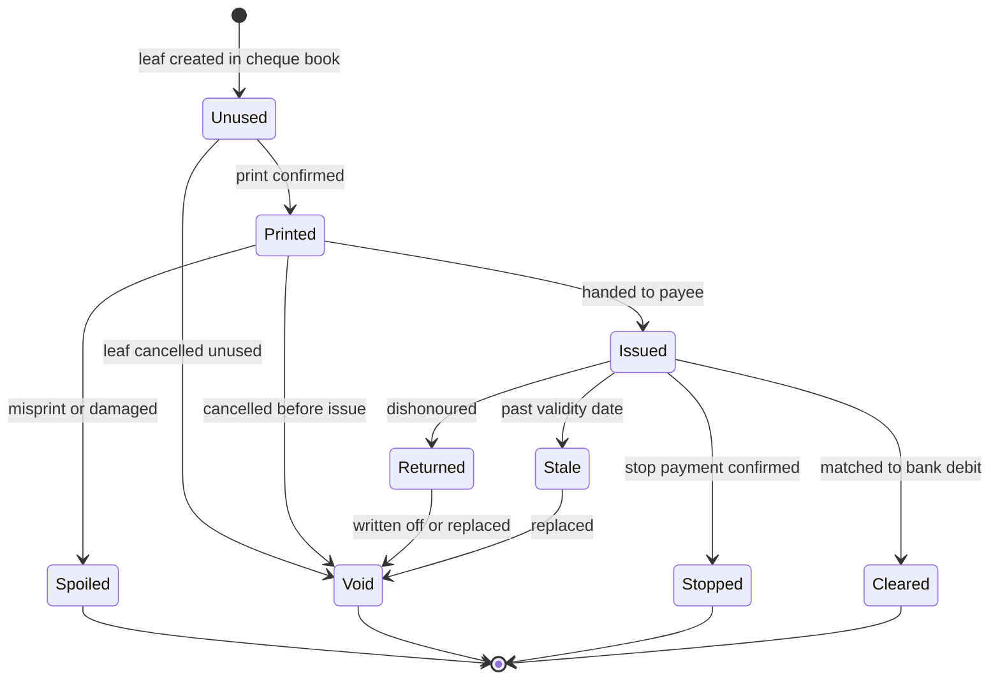

**Part A: Cheque printing** [0. Read this first](#a0) [1. What the code does today](#a1) [2. Goals and non-goals](#a2) [3. Brainstorm: options](#a3) [4. Business rules](#a4) [5. Lifecycle](#a5) [6. Data model (migration 22)](#a6) [7. Modules and function map](#a7) [8. Print engine](#a8) [9. UI blueprint](#a9) [10. Permissions and audit](#a10) [11. Sync, reconciliation, float](#a11) [12. Security and fraud controls](#a12) [13. Testing](#a13) [14. Delivery plan](#a14) [15. Risks](#a15) [16. Docs to update](#a16) **Part B: SME bookkeeping** [1. Where the app stands](#b1) [2. Target product](#b2) [3. Accounting foundation](#b3) [4. Posting rules](#b4) [5. Ledger schema](#b5) [6. Reports](#b6) [7. Payables, receivables, tax](#b7) [8. Money precision](#b8) [9. Period close and integrity](#b9) [10. Backfilling old data](#b10) [11. Code health and security](#b11) [12. Deployment and backup](#b12) [13. Roadmap](#b13) [14. Out of scope](#b14) [Sources and gaps](#src)

Voucher Manager v2.0.0 · repo commit 6947e90

# Cheque Printing Blueprint and SME Bookkeeping Guide

A complete plan for adding cheque printing to Voucher Manager, followed by technical guidance for growing the app into a simple bookkeeping tool for small businesses. Every reference to existing code was read from the repository, not assumed.

Stack: Python, Tkinter/ttkbootstrap, SQLite, ReportLab, pypdfium2, FirestoreSchema now at migration 21; the next one is 22Written 6 Oct 2026

## 0. Read this first

**Three things I could not confirm**

- **Physical cheque dimensions and MICR zone.** The CBSL General Direction 01/2006 leaves cheque specifications to LankaClear and does not list sizes. I could not retrieve LankaClear's own spec. The design therefore stores size and field positions as a per-bank-account template that you calibrate on the real cheque leaf. Do not hard-code a size.
- **Sri Lankan cheque law and bank practice** (stale-cheque period, crossing wording, post-dated cheque handling, the recent Bills of Exchange amendment). My fetches of those pages failed, so everything in section 4 marked verify is working assumption. Confirm with your bank and a lawyer before enforcing it in code.
- **Your printer.** The blueprint works for laser, inkjet and dot-matrix, but exact alignment depends on the driver. Section 8 explains how to test it.

**The core idea in one paragraph** A cheque is a second document produced from a voucher whose payment method is Cheque. A new `cheques` table holds the cheque itself (number, payee, amount, date, crossing, status). A new `cheque_printer.py` draws it onto the real cheque leaf using calibrated millimetre positions. The cheque number is written into the voucher's existing `payment_ref`, which makes your current bank reconciliation match it automatically at 0.95 confidence. A void, reprint and stop-payment workflow keeps cheque stock fully accounted for.

## 1. What the code does today

These are the facts from the repo that the cheque feature must fit into.

| Area | Fact in the code | Consequence for cheques |
| --- | --- | --- |
| Payment method | `ui/main_window.py` line 1474 offers `Cash, Bank Transfer, Cheque, Credit Card, Online/Other`. Stored in `vouchers.payment_method` with `payment_ref` (tooltip says "cheque number, transaction ID"). | Cheque is already a selectable method but has no behaviour. Hook the existing combobox variable `_payment_method_var`. |
| Float link | `create_voucher` auto-assigns the default float only when method is `Cash`. The form always shows the Float/Drawer box. | Cheque vouchers must not hit the cash float. Hide or clear the float for Cheque. |
| Printing | `printer.generate_voucher_pdf` draws 2 vouchers per A4 using ReportLab. `print_pdf` calls `os.startfile(path, "print")`. | `startfile "print"` hands the PDF to whatever app is registered, which may shrink-to-fit and shift every field. Cheques need a controlled print path (section 8). |
| Print flow | `_do_print` runs a worker thread, calls the generator, then `db.mark_as_printed`. | Copy this pattern into `_do_print_cheque`. |
| Bank module | Tables `bank_accounts`, `bank_transactions` (migration 18). `auto_match_bank_transactions` pass 1 matches `reference == payment_ref` and amount within 0.01. | Reuse `bank_accounts` as the cheque's drawee account. Writing the cheque number to `payment_ref` gets pass 1 for free. |
| Migrations | `run_migrations` is additive-only, version-tracked, uses `_ensure_col`. Last is 21. | Add migration 22 in the same style. No drops. |
| Audit | `audit_logs.voucher_id` is `NOT NULL` with a foreign key to `vouchers`. | Cheque events that exist without a voucher (spoiled leaf, unused cancelled leaf) cannot go there. Add a separate `cheque_events` table. |
| RBAC | `ROLE_PERMISSIONS` sets per role. `has_permission` returns True when no users exist. | Add `print_cheque`, `void_cheque`, `manage_cheque_books`. Remember the "no users means full access" default. |
| Cloud sync | `firebase_client.py` has one collection constant per entity and push/pull functions. `pull_cloud_vouchers` rebuilds vouchers through `create_voucher`/`update_voucher`. | Cheque data needs its own collections and a decision on who may allocate cheque numbers (section 11). |
| Editing | `update_voucher` rewrites all fields and replaces line items with no status check. | A voucher with an issued cheque must become read-only for amount and payee. |
| Money type | `total_amount REAL`. | Convert to integer cents inside cheque code. See Part B section 8. |

## 2. Goals and non-goals

### Goals

- Print a cheque from a saved voucher in one action, aligned to the real leaf.
- Track every cheque leaf: unused, printed, issued, cleared, stopped, void.
- Prevent duplicate numbers and double-paying a voucher.
- Support several banks and several cheque books per company.
- Print a cheque register and an outstanding (uncleared) list.
- Feed cheque numbers into bank reconciliation.
- Work offline first, like the rest of the app.

### Non-goals for v2.1

- MICR line printing. Banks pre-print it on the leaf.
- Printing a signature image by default (a switch, off, with controls in section 12).
- Positive Pay file export to banks. Listed as a later phase.
- Receiving and depositing customer cheques. That belongs to Part B receipts.
- Cheque image scanning.

## 3. Brainstorm: options considered

### 3.1 What do we print on?

| Option | How it works | Pros | Cons | Verdict |
| --- | --- | --- | --- | --- |
| A. Pre-printed bank cheque leaf | Feed the real leaf into the printer. Software prints only the variable fields. | Matches how most SMEs already work. No MICR cost. | Needs calibration. A bad print wastes a numbered leaf. | **Primary target** |
| B. Blank cheque stock with MICR toner | Software prints the whole cheque including MICR line. | Full control. | Needs MICR toner printer and bank approval. | Out of scope |
| C. Plain A4 "cheque request" slip | Prints payee, amount, date for the signatory to copy by hand. | Zero alignment risk. | Not a real printed cheque. | Offer as fallback mode |
| D. Voucher stub plus cheque on one sheet | Cheque at top, voucher counterfoil below on the same page. | Nice for cheque-book style paper. | Paper formats vary a lot. | Later, as a template option |

### 3.2 How do we get an exact print?

| Option | Notes |
| --- | --- |
| 1. Keep `os.startfile(pdf,"print")` | Simplest, but scaling is controlled by the PDF app. Not safe for cheques. |
| 2. Call SumatraPDF silently | Documented options: `-print-to "Printer"`, `-print-to-default`, `-silent` and `-print-settings "noscale,paper=...,bin=..."`. `noscale` gives actual size. Sumatra warns that without centring, content sits at the top-left of the sheet. Needs the exe bundled or located by the user. |
| 3. Render with `pypdfium2` (already a dependency) and print the bitmap via Windows GDI (`pywin32`) | Full control, no third-party viewer. Adds a dependency and a DPI-mapping step. Good phase-2 upgrade. |
| 4. Open the PDF for the user and tell them to print at "Actual size" | Always works, never automatic. Use as the safe fallback. |

**Decision:** ship option 4 plus option 2 (auto-detected). Keep option 3 as an optional hardening step once real printers have been tested.

### 3.3 One voucher, how many cheques?

- **One voucher, one cheque** is the common case.
- **One voucher, several cheques** covers instalments and post-dated cheques. The schema supports it through a link table.
- **Several vouchers, one cheque** covers paying one supplier for many bills. The link table supports this too, with a per-voucher allocated amount.

## 4. Business rules

1. **Eligibility.** A voucher can have a cheque printed only when `status='Active'`, `payment_method='Cheque'`, approval is satisfied (if `approval_enabled`), and its currency equals the bank account currency. Foreign-currency vouchers are blocked with a clear message in v2.1.
2. **Amount.** Cheque amount equals the voucher total, or an explicit allocation for split cases. The sum of all non-void cheque allocations for a voucher must never exceed the voucher total.
3. **Number allocation.** Next number comes from the active cheque book's `next_no`. It increases only when a cheque is saved as printed, never when a preview is shown. The user may override the number, with a warning and an audit note.
4. **Never reuse a number.** A failed print consumes the leaf. The user marks it Spoiled, which records the number and moves on. The unique key on `(bank_account_id, cheque_no)` enforces this.
5. **Reprint.** A reprint of an already printed cheque needs the same number only if the paper was not ruined. Default is: mark old one Spoiled and issue the next number. Reprint on the same leaf is allowed for Manager/Admin with a reason.
6. **Date.** Cheque date defaults to the voucher date. A date later than today marks the cheque post-dated. verify Confirm whether your banks accept post-dated cheques and how long a cheque stays valid (commonly six months in Sri Lanka). Put the validity length in settings, default 180 days, and flag cheques as Stale when the date passes.
7. **Crossing.** Options: None, General (two parallel lines), and A/C Payee Only. Default is A/C Payee Only, a company setting. verify exact wording your bank expects.
8. **Amount in words.** Generated by code, never typed. Format: `Rupees One Hundred Only`, with cents as `and Cents Fifty Only`. The number system (million versus lakh) and wording are template settings. verify against what your bank accepts. Words must be unit-tested against many values.
9. **Amount fill.** Figures print as `**1,250.00**` and the words line is padded with a trailing rule so nothing can be added later.
10. **Void.** A printed cheque may be voided with a reason and the physical leaf must be marked VOID and kept. A voided cheque releases its voucher allocation so a new cheque can be issued.
11. **Stop payment.** Records the date, bank reference and reason. Status becomes Stopped. The voucher allocation is released only after the stop is confirmed.
12. **Cancelled voucher.** `cancel_voucher` must refuse while a cheque in Printed, Issued or Cleared status exists. The user voids or stops the cheque first.

## 5. Cheque lifecycle



"Stale" is derived: it is not stored. A query computes it from `cheque_date + validity_days < today` for Issued cheques. Every transition writes a row to `cheque_events`.

## 6. Data model: migration 22

Follow the existing style: wrap in `if 22 not in applied:`, use `CREATE TABLE IF NOT EXISTS` and `_ensure_col`, finish with an `INSERT OR IGNORE INTO schema_migrations`. No drops. Money in the new tables is integer cents (see Part B section 8).

```
-- cheque_books: one physical book of leaves for one bank account
CREATE TABLE IF NOT EXISTS cheque_books (
  id INTEGER PRIMARY KEY AUTOINCREMENT,
  company_id INTEGER NOT NULL DEFAULT 1,
  bank_account_id INTEGER NOT NULL,
  book_name TEXT NOT NULL,
  prefix TEXT DEFAULT '',
  start_no INTEGER NOT NULL,
  end_no INTEGER NOT NULL,
  next_no INTEGER NOT NULL,
  number_width INTEGER NOT NULL DEFAULT 6,
  status TEXT NOT NULL DEFAULT 'active',      -- active | exhausted | closed
  created_by TEXT DEFAULT '',
  created_at TIMESTAMP DEFAULT CURRENT_TIMESTAMP,
  CHECK (end_no >= start_no),
  FOREIGN KEY (bank_account_id) REFERENCES bank_accounts(id)
);

-- cheque_templates: calibrated geometry; one default per bank account
CREATE TABLE IF NOT EXISTS cheque_templates (
  id INTEGER PRIMARY KEY AUTOINCREMENT,
  company_id INTEGER NOT NULL DEFAULT 1,
  bank_account_id INTEGER,                    -- NULL = company default
  name TEXT NOT NULL,
  page_w_mm REAL NOT NULL,
  page_h_mm REAL NOT NULL,
  paper_mode TEXT NOT NULL DEFAULT 'leaf',    -- leaf | a4_offset
  offset_x_mm REAL NOT NULL DEFAULT 0,
  offset_y_mm REAL NOT NULL DEFAULT 0,
  fields_json TEXT NOT NULL,                  -- per-field x, y, w, font, size, align
  date_format TEXT NOT NULL DEFAULT 'DDMMYYYY',
  date_boxes INTEGER NOT NULL DEFAULT 1,
  words_system TEXT NOT NULL DEFAULT 'international',
  print_stub INTEGER NOT NULL DEFAULT 0,
  is_default INTEGER NOT NULL DEFAULT 0,
  updated_at TIMESTAMP DEFAULT CURRENT_TIMESTAMP,
  FOREIGN KEY (bank_account_id) REFERENCES bank_accounts(id)
);

-- cheques: one row per leaf that has been used
CREATE TABLE IF NOT EXISTS cheques (
  id INTEGER PRIMARY KEY AUTOINCREMENT,
  company_id INTEGER NOT NULL DEFAULT 1,
  bank_account_id INTEGER NOT NULL,
  cheque_book_id INTEGER NOT NULL,
  cheque_no TEXT NOT NULL,
  payee_name TEXT NOT NULL,
  amount_cents INTEGER NOT NULL CHECK (amount_cents > 0),
  currency TEXT NOT NULL DEFAULT 'LKR',
  amount_words TEXT NOT NULL,
  cheque_date TEXT NOT NULL,                  -- YYYY-MM-DD
  is_post_dated INTEGER NOT NULL DEFAULT 0,
  crossing TEXT NOT NULL DEFAULT 'ac_payee',  -- none | general | ac_payee
  memo TEXT DEFAULT '',
  status TEXT NOT NULL DEFAULT 'printed',     -- printed|issued|cleared|returned|stopped|spoiled|void
  template_id INTEGER,
  print_count INTEGER NOT NULL DEFAULT 0,
  printed_by TEXT DEFAULT '',
  printed_at TEXT DEFAULT NULL,
  issued_to TEXT DEFAULT '',
  issued_at TEXT DEFAULT NULL,
  cleared_bank_txn_id INTEGER DEFAULT NULL,
  cleared_at TEXT DEFAULT NULL,
  void_reason TEXT DEFAULT '',
  stop_ref TEXT DEFAULT '',
  created_at TIMESTAMP DEFAULT CURRENT_TIMESTAMP,
  updated_at TIMESTAMP DEFAULT CURRENT_TIMESTAMP,
  UNIQUE (bank_account_id, cheque_no),
  FOREIGN KEY (cheque_book_id) REFERENCES cheque_books(id),
  FOREIGN KEY (bank_account_id) REFERENCES bank_accounts(id),
  FOREIGN KEY (cleared_bank_txn_id) REFERENCES bank_transactions(id) ON DELETE SET NULL
);

-- many vouchers per cheque, many cheques per voucher
CREATE TABLE IF NOT EXISTS cheque_voucher_links (
  cheque_id INTEGER NOT NULL,
  voucher_id INTEGER NOT NULL,
  allocated_cents INTEGER NOT NULL CHECK (allocated_cents > 0),
  PRIMARY KEY (cheque_id, voucher_id),
  FOREIGN KEY (cheque_id) REFERENCES cheques(id) ON DELETE CASCADE,
  FOREIGN KEY (voucher_id) REFERENCES vouchers(id)      -- no cascade: history must survive
);

-- append-only history; never updated or deleted by the app
CREATE TABLE IF NOT EXISTS cheque_events (
  id INTEGER PRIMARY KEY AUTOINCREMENT,
  company_id INTEGER NOT NULL DEFAULT 1,
  cheque_id INTEGER,
  cheque_book_id INTEGER,
  event_type TEXT NOT NULL,   -- printed, reprinted, issued, voided, spoiled, stopped, cleared, returned, number_override
  detail TEXT DEFAULT '',
  actor TEXT DEFAULT '',
  created_at TIMESTAMP DEFAULT CURRENT_TIMESTAMP
);

CREATE INDEX IF NOT EXISTS idx_cheques_comp_status ON cheques (company_id, status);
CREATE INDEX IF NOT EXISTS idx_cheques_bank_date  ON cheques (bank_account_id, cheque_date);
CREATE INDEX IF NOT EXISTS idx_cheque_links_v     ON cheque_voucher_links (voucher_id);
CREATE INDEX IF NOT EXISTS idx_cheque_events_c    ON cheque_events (cheque_id, created_at);
```

Additional columns using `_ensure_col`:

```
_ensure_col("bank_accounts", "default_cheque_book_id", "INTEGER DEFAULT NULL")
_ensure_col("vouchers", "cheque_bank_account_id", "INTEGER DEFAULT NULL")   # chosen account on the form
_ensure_col("bank_accounts", "cheque_validity_days", "INTEGER DEFAULT 180")
_ensure_col("bank_accounts", "cheque_default_crossing", "TEXT DEFAULT 'ac_payee'")
```

Default seeds: none. Templates are created by the calibration wizard on first use. Add a trigger-free rule in code that rejects updates to `cheque_events`.

## 7. Modules and function map

| File | Status | Contents |
| --- | --- | --- |
| `cheque_words.py` | new | `amount_to_words(cents, currency, system)`. Pure function, no imports from the app, heavy tests. |
| `cheque_db.py` | new | All cheque SQL, kept out of the 7,960-line `database.py`. Uses `db.get_connection()`. |
| `cheque_printer.py` | new | PDF generation, calibration page, print dispatch. |
| `ui/cheque_dialogs.py` | new | Print dialog, cheque book manager, register, calibration wizard. |
| `database.py` | edit | Migration 22; permission entries; `cancel_voucher` guard; `update_voucher` guard. |
| `ui/main_window.py` | edit | Show cheque fields when method is Cheque; new toolbar button; `_do_print_cheque`; shortcut. |
| `firebase_client.py` | edit | Collections and push functions (section 11). |
| `build_exe.py` | edit | Add `--hidden-import cheque_db --hidden-import cheque_printer --hidden-import cheque_words --hidden-import ui.cheque_dialogs`, because the PyInstaller command lists hidden imports explicitly. |
| `tests/test_cheque_*.py` | new | Section 13. |

### Core function signatures

```
# cheque_db.py
create_cheque_book(company_id, bank_account_id, book_name, start_no, end_no, prefix="", number_width=6) -> book_id
get_active_book(bank_account_id) -> dict | None
peek_next_cheque_no(book_id) -> str                       # read only; never advances
issue_cheque(voucher_ids_with_amounts, bank_account_id, *, cheque_date, crossing, payee_name=None,
             override_no=None, template_id=None, actor="") -> cheque_id
    # One transaction: validate -> allocate number -> insert cheque + links -> advance next_no ->
    # write payment_ref on vouchers -> write cheque_events + audit_logs -> commit
mark_printed(cheque_id, actor) -> None                    # increments print_count
mark_issued(cheque_id, issued_to, actor) -> None
void_cheque(cheque_id, reason, actor) -> None
spoil_cheque(cheque_id, reason, actor) -> None
record_stop_payment(cheque_id, ref, reason, actor) -> None
link_cleared(cheque_id, bank_txn_id, actor) -> None
get_cheque_register(company_id, filters) -> list[dict]
get_outstanding_cheques(bank_account_id, as_of) -> list[dict]
voucher_cheque_remaining_cents(voucher_id) -> int
derive_status(row, today) -> str                          # adds "stale"
```

**Transaction rule**Number allocation, insert, link rows, voucher update and event log must be one SQLite transaction. Use `BEGIN IMMEDIATE` so two windows on the same machine cannot take the same number. The unique key is the second line of defence.

## 8. Print engine

### 8.1 Page model

- **Leaf mode.** The PDF page size equals the cheque leaf (`page_w_mm` × `page_h_mm`). The printer must be set to a matching custom paper size or the driver will rescale.
- **A4 offset mode.** The page is A4. The cheque is drawn at `offset_x_mm/offset_y_mm` on the sheet. Used for printers that only feed A4 or that take a cheque on a carrier sheet. This is the more forgiving mode.
- Coordinates are millimetres from the top-left of the leaf. ReportLab uses bottom-left, so convert once in a helper: `y_pdf = page_h - y_mm*mm`.

Schematic only. Real positions come from the calibrated template for each bank account.

### 8.2 Calibration wizard

1. User enters the leaf width and height, measured with a ruler.
2. App prints a calibration sheet on plain paper: a millimetre ruler on all four edges, a border exactly the leaf size, crosshairs at the nominal field corners, and the text "PRINT AT 100%".
3. User lays the sheet over a real cheque against a window or light. They measure the offset of each field box and enter nudges (+/- mm) per field. Alternative: drag fields on a preview of the leaf.
4. User prints a SAMPLE cheque with a diagonal "SAMPLE - NOT NEGOTIABLE" watermark on plain paper, then on a spare leaf.
5. Template saved per bank account. Store printer name and paper setting used in the template notes.

### 8.3 Rendering rules

- Use a fixed font that is always available: Helvetica via ReportLab, as `printer.py` already does. Use a single-line shrink-to-fit helper (reduce font size down to a minimum) for payee and words. Reuse the idea of `_draw_wrapped_text` for words that need two lines.
- Date boxes: draw one character per box using a configurable pitch in mm. Format string supports `DDMMYYYY`, `YYYYMMDD`, `DD/MM/YYYY`.
- Payee: upper-case, trimmed, with a trailing rule to the end of the line.
- Crossing: two diagonal parallel lines, plus optional text `A/C PAYEE ONLY` between them.
- Amount figures right-aligned with asterisk fill. Use `Decimal` or integer cents to format; never float.
- Test mode: draw field boxes and labels in light grey so alignment is visible. Never allowed on a real leaf (the print dialog warns).
- Voided or spoiled reprints draw a large "VOID" across the leaf for the record copy.

### 8.4 Print dispatch

```
def print_cheque_pdf(pdf_path, printer_name=None, paper=None, bin_no=None):
    sumatra = _find_sumatra()          # settings path, then PATH, then bundled folder
    if sumatra:
        settings = ["noscale"]
        if paper: settings.append(f"paper={paper}")
        if bin_no: settings.append(f"bin={bin_no}")
        cmd = [sumatra, "-silent",
               "-print-to" if printer_name else "-print-to-default"]
        if printer_name: cmd.append(printer_name)
        cmd += ["-print-settings", ",".join(settings), pdf_path]
        subprocess.run(cmd, check=True, timeout=60)
        return "printed"
    printer.open_pdf(pdf_path)        # fallback: user prints at Actual size
    return "opened"
```

Keep the status honest. If the fallback was used, the app does not know whether the cheque really printed. The UI asks "Did the cheque print correctly?" with **Yes, mark printed** and **No, keep as unused**. Only Yes consumes the number, unless the user chose "mark spoiled".

**Always test on plain paper first**The print dialog must offer "Print sample on plain paper" as the default button for a newly created template and for any template edited in the last day.

## 9. UI blueprint

### 9.1 Voucher form (edit existing screen)

The screenshot shows the Bills / Payment Method / Payment Ref / Float row. Changes when `_payment_method_var == "Cheque"`:

- Float / Drawer box is hidden and `float_id` sent as `None`.
- Payment Ref becomes read-only and shows the cheque number once issued. Before issue it shows "Next: 004512".
- A new row appears: **Bank Account** (combobox from `get_bank_accounts`), **Cheque Date** (defaults to voucher date), **Crossing** (combobox).
- Footer gains **Save & Print Cheque** next to **Save & Print**. Existing **Save & Print (Ctrl+Enter)** still prints the voucher.
- Validation extension in `_validate_form`: bank account required, currency must match, amount positive, no cheque already covering the voucher.
- Use a `trace_add("write", ...)` on `_payment_method_var`, plus a call from `_load_voucher_to_form` so edits show the right state.

### 9.2 Print Cheque dialog

| Element | Behaviour |
| --- | --- |
| Header | Voucher number, payee, amount, bank account. |
| Cheque number | Shows next number from the book. "Change" opens an override with reason. Shows leaves remaining. |
| Preview | Rendered PDF page via `pypdfium2`, same approach as `ui/pdf_viewer.py`. |
| Words check | Amount in words displayed as text, with the instruction to read it before printing. |
| Buttons | Print sample (plain paper), Print on cheque, Cancel. |
| After print | Confirm dialog (section 8.4). On success the voucher gets `printed=1` via `mark_as_printed` only if the voucher document was also printed. Cheque print does not flip the voucher flag. |

### 9.3 Cheque Register

A fifth tab next to Analytics, or a dialog opened from the toolbar. Columns: Cheque No, Date, Payee, Amount, Bank, Voucher No, Status, Issued To, Cleared On. Filters: bank account, status, date range, text. Row actions: Mark issued, Void, Spoiled, Stop payment, Reprint, Open voucher. Footer totals: outstanding amount and count. Export CSV through a new function that uses the existing `_sanitize_csv_row` to block formula injection.

### 9.4 Cheque book manager

List of books with leaves used and remaining. Add book (bank, start, end, prefix). Close book. Warning chip when under 5 leaves remain. Hook into `alert_center` by adding alert types `cheque_book_low`, `cheque_stale` and `cheque_post_dated_due` to `generate_alerts`.

### 9.5 Shortcuts

Existing bindings use many `Ctrl+Shift+letter` combinations. Proposed: `Ctrl+Alt+P` print cheque, `Ctrl+Shift+H` cheque register. Check against the list in `main_window.py` lines 155 to 274 before committing; neither appears there today.

### 9.6 Settings

New "Cheques" tab in `ui/settings_dialog.py`: default crossing, validity days, words system, Sumatra path, default printer name, signature image switch.

## 10. Permissions and audit

| Permission | viewer | data_entry | cashier | manager | admin |
| --- | --- | --- | --- | --- | --- |
| `view_cheques` | yes | yes | yes | yes | yes |
| `print_cheque` | no | no | yes | yes | yes |
| `mark_cheque_issued` | no | no | yes | yes | yes |
| `void_cheque`, `stop_cheque` | no | no | no | yes | yes |
| `manage_cheque_books`, templates | no | no | no | no | yes |

- Segregation of duties: the person who prepared the voucher should not also print and issue the cheque for large amounts. Add a company setting "Cheque printer must differ from preparer above LKR X", default off.
- Printing a cheque for an amount at or above the approval thresholds requires `approval_status='approved'`.
- Every action writes `cheque_events` and, if a voucher is involved, `audit_logs` through `log_audit_event` so the voucher history screen shows cheque activity.
- `cheque_events` is append-only. The database layer exposes insert and select only.

## 11. Sync, reconciliation and cash float

### 11.1 Bank reconciliation

- `issue_cheque` writes the cheque number into `vouchers.payment_ref`. `auto_match_bank_transactions` pass 1 then matches a bank line whose reference equals the number and amount equals the total at 0.95 confidence.
- Bank statements often show the cheque number zero-padded or truncated. Add a normaliser (strip spaces and leading zeros) to pass 1, applied to both sides. This is a small, test-covered change to existing code.
- A multi-voucher cheque has one bank line but several vouchers. The matcher compares against the cheque amount, then marks all linked vouchers matched. Add a new pass 0 in `auto_match_bank_transactions` that looks in `cheques` first.
- On `confirm_reconciliation`, call `link_cleared(cheque_id, bank_txn_id)` so the register shows Cleared.
- `unmatch_bank_transaction` must revert the cheque to Issued.

### 11.2 Cash float

`get_float_ledger` includes every active voucher with `float_id` set. Cheque vouchers have none, so they are correctly excluded. Existing cheque vouchers saved before this feature may have a float if they were created through pull sync or import; add a one-time check in the migration report, do not auto-change data.

### 11.3 Multi-terminal sync

**Hard problem: two terminals, one cheque book**Firestore sync here is eventually consistent and set with `merge=True`. Two terminals could each print cheque 004512 offline. The local unique key cannot see the other machine.

Options, in order of simplicity:

1. **One printing station per cheque book** (recommended for v2.1). Each book has an owner terminal id. Other terminals can prepare vouchers but only the owner can print cheques. Enforced in `issue_cheque`.
2. **Number ranges per terminal.** Split a book into ranges (leaves 1 to 10 for terminal A, 11 to 20 for B).
3. **Firestore transaction to claim the number** when online, fall back to option 1 when offline.

Sync additions: collections `cheque_books`, `cheques` and `cheque_events`, doc id `comp_{company}_bank_{account}_chq_{number}`, following the existing `comp_{n}_v_{number}` convention. Push after every state change using the async pattern in `push_voucher_to_cloud`. Pull must be additive and never regress status (rank statuses: printed \< issued \< cleared/stopped/void and take the higher). Also add the cheque fields to `serialize_voucher` so a pulled voucher shows its cheque number.

**Existing sync gap to know about**`pull_cloud_vouchers` builds `form_data` from a fixed field list and calls `update_voucher`, which overwrites `payment_ref`. A pulled older copy could blank a cheque number. Make `update_voucher` skip `payment_ref` when a cheque link exists.

## 12. Security and fraud controls

- **Signature image:** off by default. If enabled, store it outside the main database in the data folder, require Admin, only print it when the logged-in user is the authorised signatory, and log each use. Never sync it to Firestore or Drive.
- **No silent reprints:** reprint of the same number requires Manager and a reason.
- **Number gaps:** a report lists any number in a book that has no cheque row and is below `next_no`. That is a leaf that disappeared.
- **Payee edits after print:** locked. Void and reissue instead.
- **Large amount confirmation:** typing the amount again before printing above a configurable limit.
- **Duplicate payment check:** reuse `check_potential_duplicate_voucher` and also warn when a cheque to the same payee for the same amount exists in the last 14 days.
- **CSV export:** pass every cell through `_sanitize_csv_cell`.
- **Backups:** call `backup_database(reason="before_cheque_print_batch")` before batch printing more than ten cheques.
- **Physical:** unused cheque books are valuables. The book manager can record who holds each book.

## 13. Testing

Follow the pattern in `tests/test_printer.py`: a temp directory, patch `db.DB_PATH`, `db.ATTACHMENTS_DIR`, `db.BACKUP_DIR`, call `db.init_db()`, tear down with `shutil.rmtree`.

| Test file | What it proves |
| --- | --- |
| `test_cheque_words.py` | 0.01, 1, 10, 11, 19, 20, 21, 99, 100, 101, 999, 1,000, 1,001, 12,345.67, 100,000, 1,000,000, 2,500,000.50, 999,999,999.99. Zero is rejected. Negative is rejected. Cents wording. Both number systems. Exactly one expected string each. |
| `test_cheque_db.py` | Migration 22 is idempotent (run twice). Book creation. Number allocation advances once. Duplicate number rejected. Override logged. Over-allocation refused. Void releases allocation. Cancel voucher blocked while cheque is live. Event log cannot be modified. Concurrent allocation from two threads gives two different numbers. |
| `test_cheque_printer.py` | PDF is produced and non-empty. Page size matches template. Calibration page generated. Text extraction (via `pypdfium2`) contains the payee, words and figures. Field coordinates fall inside the page. Date box output for each format. Long payee shrinks and never overflows. |
| `test_cheque_reconcile.py` | Bank reference with leading zeros matches. Multi-voucher cheque matches one bank line. Unmatch reverts status. |
| `test_cheque_permissions.py` | Each role may or may not call each action, as in section 10. |
| `test_cheque_sync.py` | Status ranking never regresses. Document id format. Mock Firestore like `tests/test_firebase.py`. |

### Manual test script (real hardware)

1. Print calibration sheet on plain paper at 100%. Measure the border with a ruler. It must equal the entered size within 0.5 mm.
2. Overlay on a real leaf, adjust, print sample, overlay again.
3. Print on a spare leaf and have the bank branch confirm it is acceptable before using real stock.
4. Repeat for each printer and each bank account template.
5. Print the longest payee name and the largest amount you expect.

## 14. Delivery plan

| Phase | Scope | Done when |
| --- | --- | --- |
| **0. Prep** | Branch. Decide the bank templates you need. Gather one real cheque leaf per bank. Confirm bank requirements (section 0). | Written answers to the three open items. |
| **1. Data** | Migration 22. `cheque_db.py` core with tests. Permissions. | test_cheque_db passes. Old database upgrades with no data change. |
| **2. Words and render** | `cheque_words.py`. `cheque_printer.py` PDF and calibration page. | Sample PDF visually checked against a real leaf using overlay. |
| **3. UI** | Form changes. Print dialog. Book manager. Calibration wizard. Settings tab. | A user can set up a book and print a cheque end to end on plain paper. |
| **4. Lifecycle** | Register. Issue, void, spoil, stop. Alerts. Reports. CSV. | Every transition in the diagram is reachable and logged. |
| **5. Reconcile and sync** | Matcher changes. Firestore collections. Terminal ownership rule. | Two-terminal test does not duplicate a number. |
| **6. Hardening and release** | Sumatra dispatch. Bank pilot with real leaves. Docs. Release notes as `RELEASE_NOTES_v2.1.0.md`. Update `build_exe.py`. | Pilot company runs a week with no misprint. |

Suggested order of commits: migration, db module with tests, words with tests, printer, UI shell, lifecycle, reconcile, sync, polish. Keep each commit passing the existing 17 test files.

## 15. Risks

| Risk | Likelihood | Impact | Mitigation |
| --- | --- | --- | --- |
| Misalignment wastes leaves | High at first | Cost, cheques rejected | Calibration wizard, plain-paper default, bank pilot. |
| Wrong amount in words | Low | High | Exhaustive tests, on-screen words check before print. |
| Duplicate cheque number across terminals | Medium | High | One printing station per book. |
| Viewer app rescales printout | High if using startfile | High | Controlled dispatch and honest confirmation step. |
| Fraud by editing after print | Low | High | Locks, event log, role split. |
| Bank rejects layout or wording | Medium | Medium | Bank approves a sample before go-live. |
| Legal assumptions are wrong | Unknown | Medium | All legal numbers are settings, not constants. |
| `database.py` grows further | Certain | Maintenance | New SQL lives in `cheque_db.py`. |

## 16. Documents to update

- `ARCHITECTURE.md`: new tables, module map, lifecycle diagram, print dispatch.
- `README.md`: feature list, shortcut table, setup steps for first cheque book.
- New `RELEASE_NOTES_v2.1.0.md` in the style of the existing release notes.
- New `docs/CHEQUE_SETUP_GUIDE.md` for end users with the calibration steps and photos.
- `SECURITY.md`: signature image handling.

## Part B. SME bookkeeping guidance

### 1. Where the app stands

Voucher Manager is a payment-voucher and petty-cash tool. It records money going out, organises it by payee, category and tag, tracks cash floats, reconciles to bank statements and syncs between terminals. It does not yet have a chart of accounts, journal entries, a record of money coming in, customers, invoices, or financial statements.

| Bookkeeping need | Today | Gap |
| --- | --- | --- |
| Cash book | `get_float_ledger` with running balance | Covers cash floats only, not bank. |
| Bank book | `bank_transactions` imported from CSV | No running book of the company's own entries. |
| Expense records | Vouchers, line items, categories | Categories are labels, not accounts. |
| Supplier balances | `bill_status`, `due_date`, `get_payee_statement` | No payable recorded when a bill arrives, only when paid. |
| Income | None (float inflows only) | No sales or receipts. |
| Profit and loss, balance sheet | Expense summary and analytics | No statements, no trial balance. |
| Tax | `people.tax_id`, a "Tax Deductible" tag | No tax codes or tax reports. |
| Audit | `audit_logs` per voucher | No tamper evidence, no period lock. |
| Fixed assets, payroll, stock | None | Out of scope for a simple book (section 14). |

The screenshot you shared illustrates the point: the header shows **Main Cash Float: OVERDRAWN: LKR -100.00**. The app lets a cash voucher drive the float negative and only warns. A real cash book never goes negative. Decide a policy: block, require approval, or auto-record a "paid from owner's pocket" liability.

## 2. Target product

### Simple mode (default)

For owners who are not accountants. They keep entering vouchers and receipts exactly as now. The app posts the accounting in the background. They see: cash and bank balances, money owed to suppliers, money owed by customers, monthly profit, and a tax-ready export. No debits and credits shown.

### Accountant mode

Unlocked per user. Shows chart of accounts, manual journals, trial balance, general ledger, period close. Same data, more detail, so an external accountant can audit or take over.

Design rule: **vouchers stay the source of truth for payments.** The ledger is derived from them by posting rules, so the existing workflow, attachments, approvals and printing remain unchanged and low-risk.

## 3. Accounting foundation

### 3.1 Method

- Use **double-entry** internally. Every posting has equal debits and credits. This is what lets you prove the books balance and produce statements.
- Offer **cash basis** and **accrual basis** as a company setting. Cash basis posts expense when paid. Accrual posts when the bill is recorded and again when it is paid. Small businesses often start on cash basis. verify which basis your tax authority accepts for your business type.
- Ledger entries are **immutable**. A correction is a reversing entry plus a new entry, never an edit. This matches your existing rule that deletion is soft-cancel first.

### 3.2 Chart of accounts

Seed a small default chart per company, editable and renameable, with codes in ranges:

| Range | Type | Examples |
| --- | --- | --- |
| 1000s | Asset | Cash float(s), Bank accounts, Accounts receivable, Cheques in hand, Prepaid, Advances to staff |
| 2000s | Liability | Accounts payable, Tax payable, Loans, Staff payable, Owner loan |
| 3000s | Equity | Owner capital, Drawings, Retained earnings |
| 4000s | Income | Sales, Other income, FX gain |
| 5000s | Cost of sales | Purchases, Direct labour |
| 6000s | Expense | One account per existing category, Bank charges, FX loss |

- Link each `money_floats` row to an asset account and each `bank_accounts` row to another. That is how the cash and bank books tie into the ledger.
- Map each existing `categories` row to an expense account through a new `categories.account_id` column. Unmapped categories post to "Uncategorised expense" and appear on a fix-me list.
- Also map `people` to supplier or customer role.

## 4. Posting rules

| Event | Debit | Credit |
| --- | --- | --- |
| Cash voucher, cash basis | Expense account of each line item | Cash float account |
| Cheque voucher, cash basis | Expense accounts | Cheques issued (uncleared) liability or bank account, per setting |
| Cheque clears | Cheques issued (uncleared) | Bank account |
| Bank transfer or card voucher | Expense accounts | Bank account |
| Supplier bill received (accrual) | Expense accounts | Accounts payable |
| Pay supplier bill | Accounts payable | Cash, bank or cheque account |
| Float top-up from bank | Cash float | Bank |
| Fund reimbursement (migration 13 feature) | Cash float | Bank or cash source |
| Customer sale (accrual) | Accounts receivable | Sales (and tax payable) |
| Customer receipt | Cash or bank | Accounts receivable or Sales |
| Voucher cancelled | Reverse of original | Reverse of original |
| Foreign currency voucher | Expense at `base_currency_total` | Account at same base value; difference at settlement to FX gain or loss |

**Voucher approval status**Post only vouchers that are Active and, when approval is enabled, approved. Drafts and rejected vouchers do not touch the ledger.

Implement the rules as **data** in a `posting_rules` table plus a small Python function per event type, so an accountant can adjust account mapping without code changes. Every posting records `source_type` and `source_id` so a ledger line always links back to its voucher.

## 5. Ledger schema (proposed migrations 23 and later)

```
CREATE TABLE IF NOT EXISTS accounts (
  id INTEGER PRIMARY KEY AUTOINCREMENT,
  company_id INTEGER NOT NULL,
  code TEXT NOT NULL,
  name TEXT NOT NULL,
  type TEXT NOT NULL CHECK (type IN ('asset','liability','equity','income','cogs','expense')),
  parent_id INTEGER,
  is_system INTEGER DEFAULT 0,       -- seeded, cannot be deleted
  is_active INTEGER DEFAULT 1,
  UNIQUE (company_id, code)
);

CREATE TABLE IF NOT EXISTS journal_entries (
  id INTEGER PRIMARY KEY AUTOINCREMENT,
  company_id INTEGER NOT NULL,
  entry_date TEXT NOT NULL,
  period TEXT NOT NULL,                 -- 'YYYY-MM'
  source_type TEXT NOT NULL,            -- voucher | cheque | bank | manual | opening | reversal
  source_id INTEGER,
  memo TEXT DEFAULT '',
  reverses_entry_id INTEGER,            -- set on reversal entries
  posted_by TEXT DEFAULT '',
  posted_at TIMESTAMP DEFAULT CURRENT_TIMESTAMP,
  UNIQUE (company_id, source_type, source_id, reverses_entry_id)   -- makes posting idempotent
);

CREATE TABLE IF NOT EXISTS journal_lines (
  id INTEGER PRIMARY KEY AUTOINCREMENT,
  entry_id INTEGER NOT NULL,
  account_id INTEGER NOT NULL,
  debit_cents INTEGER NOT NULL DEFAULT 0 CHECK (debit_cents >= 0),
  credit_cents INTEGER NOT NULL DEFAULT 0 CHECK (credit_cents >= 0),
  party_id INTEGER,                      -- people.id for supplier/customer sub-ledgers
  currency TEXT DEFAULT 'LKR',
  foreign_amount_cents INTEGER,
  CHECK ((debit_cents = 0) != (credit_cents = 0)),
  FOREIGN KEY (entry_id) REFERENCES journal_entries(id),
  FOREIGN KEY (account_id) REFERENCES accounts(id)
);

CREATE TABLE IF NOT EXISTS accounting_periods (
  company_id INTEGER NOT NULL,
  period TEXT NOT NULL,
  status TEXT NOT NULL DEFAULT 'open',   -- open | closed
  closed_by TEXT, closed_at TEXT,
  PRIMARY KEY (company_id, period)
);

CREATE TABLE IF NOT EXISTS posting_rules (
  id INTEGER PRIMARY KEY AUTOINCREMENT,
  company_id INTEGER NOT NULL,
  event_type TEXT NOT NULL,
  debit_account_id INTEGER, credit_account_id INTEGER,
  UNIQUE (company_id, event_type)
);

CREATE INDEX IF NOT EXISTS idx_jl_account ON journal_lines (account_id);
CREATE INDEX IF NOT EXISTS idx_je_period  ON journal_entries (company_id, period);
```

Additional columns: `categories.account_id`, `money_floats.account_id`, `bank_accounts.account_id`, `people.party_type` (supplier, customer, staff, other), `companies.accounting_basis` (cash or accrual), `companies.fiscal_year_start_month`.

**Balance check.** A function `assert_entry_balanced(entry_id)` runs before commit inside the posting transaction. A nightly integrity query confirms `SUM(debit_cents) = SUM(credit_cents)` per entry and overall. Because the CHECK constraints sit in SQLite, a bug cannot store a negative number.

**Deletion.** Because `permanently_delete_voucher` and `clear_all_vouchers` exist, the ledger must block them once a voucher has a posted entry. Only cancellation (which posts a reversal) is allowed after posting.

## 6. Reports

| Report | Built from | Notes |
| --- | --- | --- |
| Cash book | Journal lines on float accounts | Replaces the ad-hoc float ledger over time; opening balance becomes an opening entry. |
| Bank book and reconciliation statement | Journal lines on a bank account vs `bank_transactions` | Book balance plus outstanding cheques minus unpresented deposits equals bank balance. Uses section A outstanding list. |
| Profit and loss | Income, cost of sales, expense accounts for a period | Compare to prior month, prior year, and budget (`categories.monthly_budget`). |
| Balance sheet | Asset, liability, equity at a date | Includes current-year profit in equity. |
| Trial balance | All accounts at a date | The first screen an accountant asks for. |
| General ledger / account statement | Journal lines per account | Drill from any figure to the voucher and its attachments. |
| Supplier and customer aging | Payable and receivable sub-ledgers | Evolves `get_due_date_aging`. |
| Cash flow summary | Cash and bank movements by category | Direct method is enough for SMEs. |
| Tax summary | Tax accounts by code | See section 7. |
| Cheque register and outstanding cheques | Part A | Feeds bank reconciliation. |
| Accountant pack | All of the above | One zip: trial balance, ledger, bank recs and attachments, created with the existing CSV and PDF engines. |

Implementation: reports are SQL over `journal_lines` joined to `accounts`, grouped by period. Use the existing ReportLab approach in `generate_payee_statement_pdf` for PDFs and the existing CSV exporters with `_sanitize_csv_cell`. Cache report results in the same `_CACHE` pattern used for dashboard stats and invalidate on posting.

## 7. Payables, receivables and tax

### Payables

- Add a **Bill** document: supplier, bill number, bill date, due date, lines, attachment. Posting under accrual: expense and payable. Paying it creates a voucher that clears the payable.
- Your `bill_status` (Pending, Received, Partial) already hints at this. Today it flags whether the paper bill arrived. Keep it, and add a separate payment status.
- Supplier statement = existing `get_payee_statement` extended with opening balance and running balance.

### Receivables

- Phase later: customers, simple invoices numbered per company like voucher numbers, receipts, credit notes, aging.
- Keep invoices minimal: no inventory, no recurring complexity at first. Reuse `recurring_schedules` for repeating invoices later.

### Tax

- Create `tax_codes` (name, rate in basis points, type input or output, account). Rates are data, not constants, because they change.
- Add tax columns to `line_items`: `tax_code_id`, `tax_cents`, with the amount stored net or gross by company setting.
- verify Which Sri Lankan taxes apply to your clients (VAT, other levies, withholding) and registration thresholds. I did not research current rates; do not hard-code any.
- Tax summary report groups by code and period for filing, with each line linking back to its voucher.
- Use `people.tax_id` on supplier invoices where required.

## 8. Money precision

**Today's amounts are floating point**`vouchers.total_amount`, `line_items.amount`, `money_floats.opening_balance` and bank amounts are SQLite `REAL`. The code compares with `abs(a - b) < 0.01` in several places. That works for small sums but drifts when many values are added and cannot guarantee that debits equal credits.

- New ledger and cheque tables use **integer cents** (`*_cents`). Convert at the boundary with `int(round(Decimal(str(x)) * 100))`. Never use `round(x*100)` on a float directly.
- Use `decimal.Decimal` in Python for any calculation, with `ROUND_HALF_UP` at a single rounding point per line.
- Currencies have different decimal places (`currencies.decimal_places`: JPY is 0). Store minor units and format through the currency's places.
- Existing REAL columns can stay. Do not rewrite history. Convert when posting and add a daily check that each voucher's cents total equals the sum of its line items.
- A later migration may add `*_cents` mirrors to vouchers, filled by a backfill, so reports no longer touch floats.

## 9. Period close and integrity

- **Period lock.** Closing a month blocks create, edit, cancel and delete of vouchers dated in it, and posting into it. Admin can reopen with a reason. Enforce in `create_voucher`, `update_voucher`, `cancel_voucher` and `bulk_import_vouchers_csv`.
- **Close checklist.** All bank accounts reconciled for the month, no unmapped categories, no drafts awaiting approval, float counted, trial balance balances.
- **Tamper evidence.** Add a hash chain to the journal: each entry stores `sha256(prev_hash + entry_json)`. A verify button recomputes the chain. It does not stop a determined attacker with file access but exposes accidental or casual edits.
- **Generalise the audit log.** `audit_logs.voucher_id` is NOT NULL, so create `audit_events (entity_type, entity_id, action, before_json, after_json, actor, at)` and write all new changes there. Keep the old table for compatibility.
- **Year-end.** Close income and expense into retained earnings with a system entry; open the new year with balances carried forward.
- **Float counts.** Add a "count cash" action that records physical count versus book and posts the difference to a cash over/short account.

## 10. Backfilling existing data

1. Take a backup with `backup_database(reason="pre_ledger")`. The migration framework already does this at every start.
2. Create the default chart and map categories automatically by name, leaving the rest unmapped.
3. Choose a **go-live date**. Post an opening balance entry for every float and bank account as at that date from `get_float_ledger` and the latest bank figures. Vouchers before the date are not re-posted; they remain as history.
4. Run an idempotent job that posts every Active voucher on or after the go-live date. The unique key on `journal_entries` means re-running does nothing twice.
5. Show a preview report ("these 214 vouchers will post; 9 have unmapped categories") and require the owner to confirm.
6. Verify: ledger cash balance equals `get_float_ledger` current balance for every float. Any difference is listed and blocks go-live.

## 11. Code health and security

Findings from reading the repository. Fix the security items before adding more money features.

### Security

| Finding | Where | Action |
| --- | --- | --- |
| Default admin password `"12345"` is in source and applied on first start | `database.py` line 15, `init_db` | Force a password change at first launch. Do not seed a known password. |
| `ARCHITECTURE.md` section 4.6 prints a different master password in plain text | `ARCHITECTURE.md` | Remove it now. It is in a public repository history, so treat that password as exposed and change it anywhere it is used. |
| PBKDF2 uses 100,000 iterations | `_hash_password_pbkdf2` | Raise (current guidance for SHA-256 is far higher). Store the count in the hash string, which the format already does, and rehash on next login. |
| PIN check falls back to direct string compare | `_verify_pin_hash` step 3 | Remove after a one-time migration of any plain PINs. Keep constant-time comparison. |
| Short numeric PINs, no lockout | `authenticate_user` | Add attempt counter, delay and temporary lock; log failures. |
| Hashed PINs and users are synced to Firestore | `push_user_to_cloud` | Review what leaves the machine; limit Firestore rules per company. |
| Firestore REST path uses an API key in the URL | `push_voucher_to_cloud` | Restrict the key as `SECURITY.md` advises, and write strict Firestore security rules. |
| RBAC is off when no users exist | `has_permission` | Prompt owner to create an admin on first run; show a banner while RBAC is off. |
| Database not encrypted at rest | SQLite file | Offer SQLCipher or OS-level folder encryption for sensitive clients. |

### Maintainability

- `database.py` is about 7,960 lines and `ui/main_window.py` about 3,226. Split by domain: `db/vouchers.py`, `db/floats.py`, `db/bank.py`, `db/users.py`, `db/ledger.py`, `db/cheques.py`. Keep `database.py` as a thin facade re-exporting names so existing imports and tests keep working.
- Many functions open their own connection. Move to a small unit-of-work helper so that "save voucher, post ledger, log audit" are one transaction.
- Print and error messages: replace `print("Notice: ...")` with the `logging` module, already used in `firebase_client.py`.
- Voucher audit text hard-codes "LKR" in `create_voucher` and `update_voucher`; use the voucher currency.
- `update_voucher` has no status guards: add them (cancelled, period closed, cheque issued).
- Add type hints and docstrings for new modules, a `ruff` config and a CI workflow in `.github/workflows` that runs `python -m unittest discover tests`. There is no workflow file today, only issue and PR templates.
- Add tests for the main window logic by extracting form validation into plain functions; `tests/test_widgets.py` shows the existing approach.
- SQLite: WAL is set in `init_db`. Set `PRAGMA busy_timeout` in `get_connection` so brief lock contention retries instead of failing.

## 12. Deployment, backup and support

- **Backups.** Today only a pre-migration snapshot is kept (last 5). Add a daily automatic backup on first launch of the day, 30 daily and 12 monthly, plus a "Back up now" button and a visible "last backup" indicator. Include the `attachments` folder, not only the database.
- **Restore.** A restore wizard that validates the file, snapshots the current database, then swaps. Test restore as part of release testing, not only backup.
- **Off-site.** You already have Drive sync for attachments. Extend it to encrypted database backups.
- **Updater.** `updater.py` replaces the exe from GitHub Releases. Add a SHA-256 checksum file to each release and verify it before replacing, and consider signing the executable to reduce SmartScreen warnings.
- **Packaging.** Add new modules to the hidden imports list in `build_exe.py` each time.
- **Support.** A "Create diagnostic bundle" button: version, schema version, last 200 log lines, integrity check results, no personal data.
- **Data export.** Full export to CSV and a single zip so a customer is never locked in.

## 13. Roadmap

| Release | Theme | Contents |
| --- | --- | --- |
| **v2.0.1** | Security first | Remove published password from docs, forced admin password change, lockout, `busy_timeout`, daily backups, CI workflow. |
| **v2.1** | Cheque printing | Part A in full. |
| **v2.2** | Ledger foundation | Accounts, journal, posting from vouchers and floats, opening balances, trial balance, cash book, period lock, backfill tool. Invisible to simple-mode users except new reports. |
| **v2.3** | Statements and bank | P&L, balance sheet, bank book, reconciliation statement tied to ledger, cheque clearing postings, accountant pack. |
| **v2.4** | Payables and tax | Bills, supplier ledger, aging, tax codes, tax summary. |
| **v2.5** | Income side | Customers, invoices, receipts, credit notes, receivable aging. |
| **v3.0** | Platform | Split `database.py`, optional encrypted database, web or mobile companion for approvals and receipt capture, import from other accounting packages. |

### Quality gates for every release

- All existing tests plus new ones pass on Windows with the supported Python version.
- Upgrade test: open a copy of a real production database, run migrations, compare row counts and totals before and after.
- Ledger invariants: debits equal credits, ledger cash equals float ledger, no unmapped categories after go-live.
- Manual smoke test of print, preview, attachment, sync and restore.
- Release notes and architecture document updated.

## 14. Out of scope for a "simple" book

Payroll with statutory deductions, inventory costing, fixed asset depreciation schedules, multi-entity consolidation, e-filing integrations and manufacturing costing each make the product several times larger. Offer clean exports so an accountant or a specialist tool handles them. Add depreciation or stock only after real customers ask, and only as optional modules.

## Sources and gaps

- Repository `praneeththilina/voucher`, commit `6947e90`: `database.py`, `printer.py`, `firebase_client.py`, `ui/main_window.py`, `ARCHITECTURE.md`, `SECURITY.md`, `BRAINSTORMING_IDEAS.md`, `tests/test_printer.py`.
- [CBSL General Direction No. 01/2006](https://www.cbsl.gov.lk/sites/default/files/cbslweb_documents/laws/cdg/6_GenDirection_2006e.compressed_0.pdf): MICR and article standards are delegated to LankaClear; no dimensions given.
- [SumatraPDF command-line arguments](https://www.sumatrapdfreader.org/docs/Command-line-arguments) and [printing guide](https://www.sumatrapdfreader.org/docs/Printing): `-print-to`, `-print-to-default`, `-silent`, `-print-settings` with `noscale`, `paper=`, `bin=`; default shrink behaviour; top-left placement at actual size.
- Search results consulted but whose pages I could not read: LankaClear CITS pages, Sri Lankan cheque law articles. The cheque size, stale-cheque period, crossing wording, post-dated cheque rules, dishonour law updates and tax rates are therefore unverified.

**Next step**Gather one real cheque leaf per bank and get each bank's written layout requirements. That unlocks phase 2, and it is the only input the design cannot proceed without.